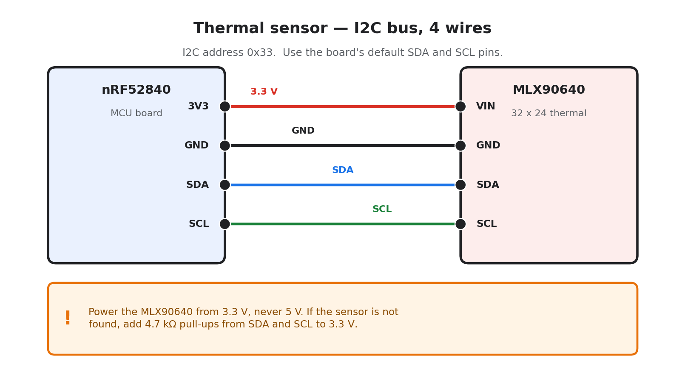
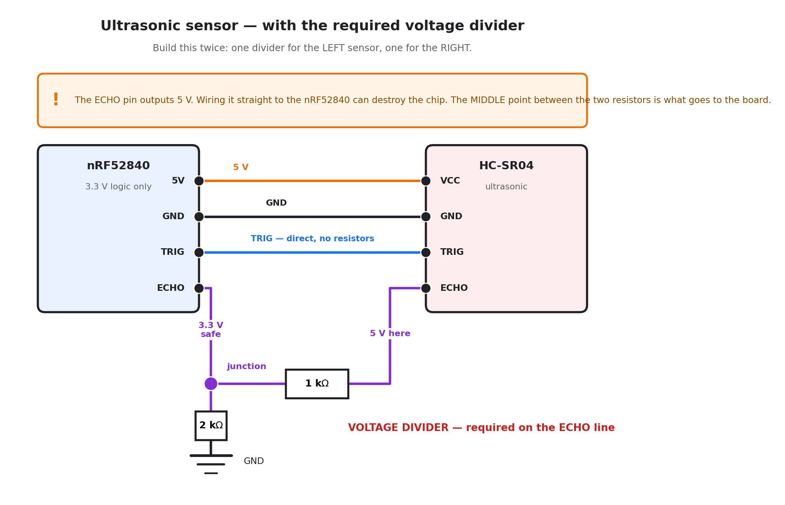
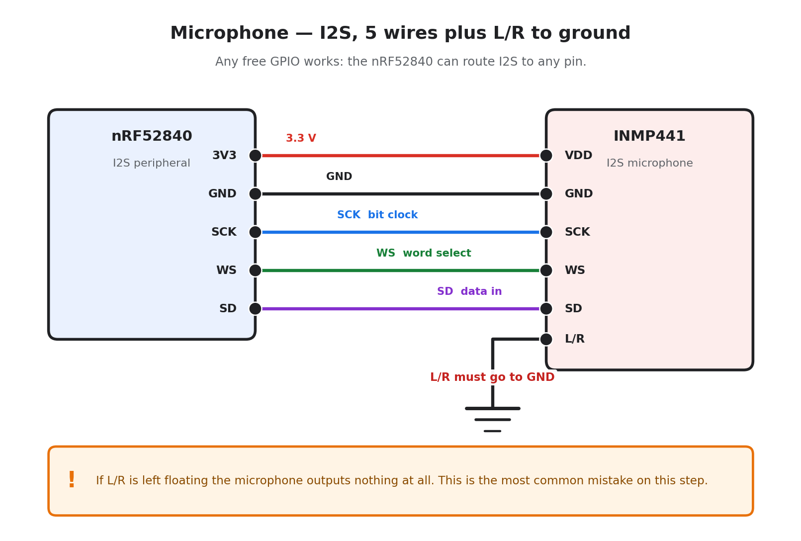
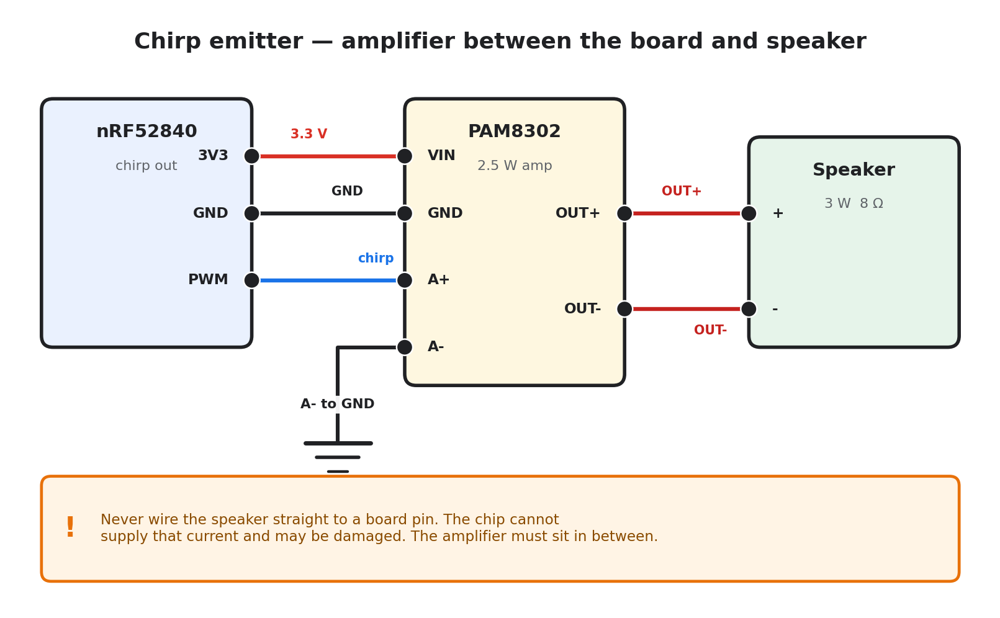
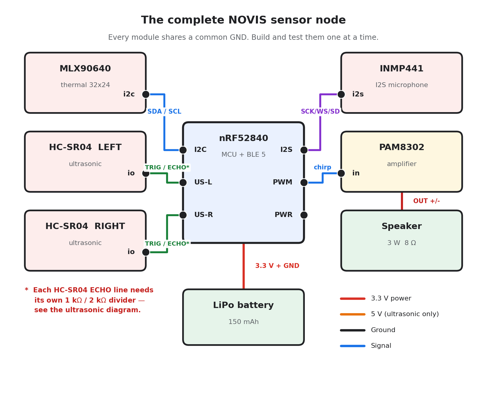
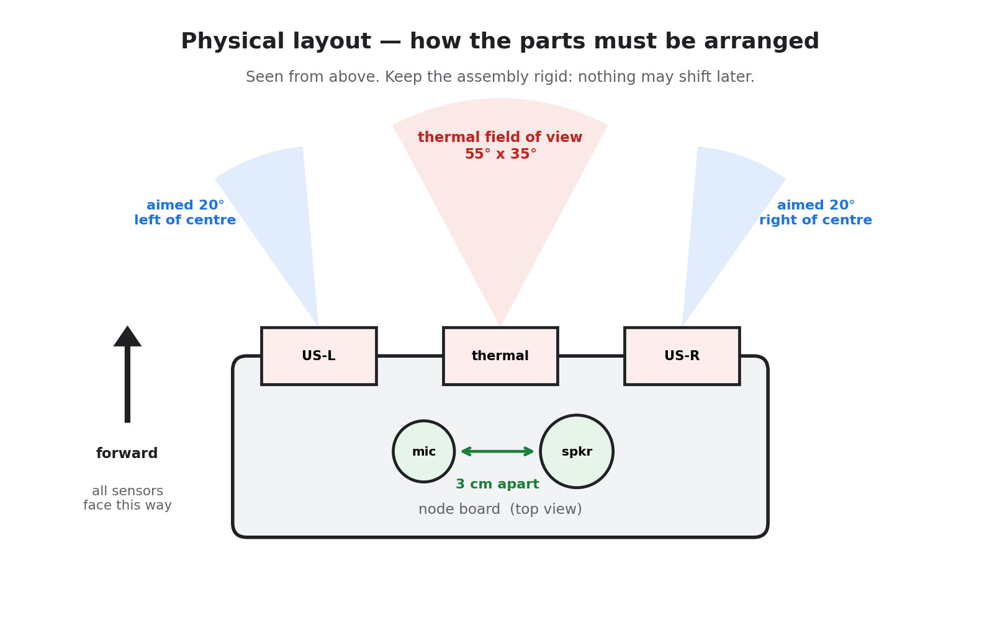

# NOVIS — Complete Build, Code & Experiment Guide

**For the NOVIS team. Everything you need is in this one document.**

Project: NOVIS (Non-Optical Visual Inference System)
Code repository: https://github.com/MdAhbab/novis_model
Last updated: 1 September 2026

---

## Table of Contents

0. [Read this first](#0-read-this-first)
1. [The big picture](#1-the-big-picture)
2. [What you need](#2-what-you-need)
3. [Part A — Set up your computer](#part-a--set-up-your-computer)
4. [Part B — Build the hardware, one sensor at a time](#part-b--build-the-hardware-one-sensor-at-a-time)
5. [Part C — Write the firmware](#part-c--write-the-firmware)
6. [Part D — Host side: receive the data](#part-d--host-side-receive-the-data)
7. [Part E — Collect real data](#part-e--collect-real-data)
8. [Part F — Experiments and measurements](#part-f--experiments-and-measurements)
9. [Part G — Command cheat sheet](#part-g--command-cheat-sheet)
10. [Troubleshooting](#10-troubleshooting)
11. [Who does what](#11-who-does-what)

---

## 0. Read this first

### What this document is

This is a step-by-step guide to build the NOVIS sensor node, write its
firmware, connect it to a computer, and collect real data. You should not
need any other document while working. Every command and every piece of
code you need is written here.

### How to use it

Work through the parts **in order**. Do not skip ahead. Each step ends with
a test. **Do not move to the next step until the test passes.** This is the
single most important rule in this guide. If you wire all five sensors at
once and nothing works, you will not know which one is broken. If you wire
one sensor, test it, then add the next, you always know exactly what broke.

### A note on honesty

Some numbers in our paper are still *estimates* (battery life, power draw,
range). The whole point of building the hardware is to replace those
estimates with **real measured numbers**. When you measure something, write
down what you actually measured — never write down what you expected.

---

## 1. The big picture

### What NOVIS does

NOVIS reconstructs a picture of a room **without using a camera**.

A small battery-powered device (we call it the **node**) sits in a room. It
has three kinds of sensors, none of which is a camera:

| Sensor | What it senses | Think of it as |
|---|---|---|
| **MLX90640** thermal array | Heat, as a 32×24 grid of temperatures | A very blurry heat picture |
| **HC-SR04** ×2 ultrasonic | Distance to the nearest surface | A tape measure that works by sound |
| **INMP441** mic + speaker | Echoes of a short chirp sound | How a bat "sees" |

The node does **no thinking**. It only:
1. Reads the sensors
2. Packs the readings into small packets ("frames")
3. Encrypts each packet
4. Sends them over Bluetooth to a computer or phone (the **host**)

The host runs our AI model, **NOVISNet**, which turns those sensor readings
into four pictures at once:
- a grayscale image
- a depth map (how far away everything is)
- a guessed colour image
- a confidence map (how much to trust the guessed colour)

### The flow, in one line

```
Sensors → ESP32 → encrypt → Bluetooth → Host PC → NOVISNet → images
```

> **Board change (1 Sept 2026):** the team switched the node MCU from an
> nRF52840 ProMicro clone to a plain **ESP32-WROOM-32 DevKit**. The ESP32 has
> real labelled pins, a proper USB-serial chip (no fiddly UF2 bootloader
> dance), and was already our go-to board for debugging the thermal sensor.
> Everything sensor-side in Part B below is written for the ESP32 and has
> real, tested pin numbers. **Part C (firmware) is the one place this is
> not a drop-in swap** — see the note there.

### Why the node is "dumb"

The node has a tiny battery. Running an AI model would drain it in minutes.
So the node only senses and transmits, and the host — which has a big
battery and a real processor — does all the heavy work. This is called
**split computing**, and it is one of our paper's contributions.

---

## 2. What you need

### Hardware — all of this is already bought ✅

| # | Part | What it does |
|---|---|---|
| 1 | **ESP32-WROOM-32** DevKit board | The brain. Reads sensors, encrypts, sends Bluetooth |
| 2 | **MLX90640** 32×24 thermal array (ours is a **GY-MCU90640** module — see B2) | Heat image |
| 3 | **HC-SR04** ultrasonic module ×2 | Distance measurement |
| 4 | **INMP441** I2S microphone | Records echoes |
| 5 | **3W 8Ω speaker** | Emits the chirp sound |
| 6 | **PAM8302** audio amplifier | Makes the chirp loud enough |
| 7 | **LiPo battery** (150 mAh or similar) | Power |

### Also needed (basic workshop items)

- Breadboard and jumper wires (male-to-male, male-to-female)
- Resistors for the voltage divider: **2× 1 kΩ and 2× 2 kΩ** (see Part B3 — this is important)
- **2× 4.7 kΩ resistors** for the MLX90640 I2C pull-ups (see Part B2 — our
  breakout does not have adequate ones built in)
- A multimeter (for the power measurement experiment in Part F)
- A USB cable that supports **data**, not only charging
- A smartphone with a camera (for the real data capture in Part E)

### Software

- **Windows PC** with Python 3.11 or 3.12
- **Arduino IDE** (version 2.x)
- **Git**
- An **NVIDIA GPU** — only needed on the machine that trains the model. The
  hardware and firmware work described in Parts A–F needs no GPU.

---

## Part A — Set up your computer

### A1. Get the code

Open PowerShell or Command Prompt and run:

```bash
git clone https://github.com/MdAhbab/novis_model.git
```

```bash
cd novis_model
```

Now create a Python virtual environment. This keeps our project's packages
separate from the rest of your computer, so nothing conflicts.

```bash
py -3.12 -m venv .venv
```

```bash
.venv\Scripts\activate
```

After this, your command prompt line should start with `(.venv)`. That means
the environment is active. **You must run this `activate` command every time
you open a new terminal window for this project.**

Now install the packages:

```bash
python -m pip install --upgrade pip
```

If you have an NVIDIA GPU (needed only for training):

```bash
pip install torch --index-url https://download.pytorch.org/whl/cu128
```

If you do **not** have an NVIDIA GPU (fine for hardware/firmware work):

```bash
pip install torch
```

Then install everything else:

```bash
pip install -r requirements.txt
```

### A2. Check that it works — no hardware needed

This is important. Before touching any wires, confirm the software side runs.

```bash
python tests/test_smoke.py
```

You should see `ALL SMOKE TESTS PASSED` at the end.

Now test the full host pipeline — this builds a fake sensor frame, encrypts
it, splits it into Bluetooth-sized pieces, puts it back together, decrypts
it, and runs the model on it. Exactly what will happen with real hardware:

```bash
python tests/test_host_pipeline.py
```

Then run the whole thing end to end with fake sensor data:

```bash
python -m host.live_infer --source synthetic --config configs/base.yaml
```

This writes a file at `results/live_output.npz`. If this works, your
computer is ready. The images will look like noise — that is expected,
because no trained model exists yet.

> **Why this matters:** if something breaks later with real hardware, you
> now know for certain the problem is the hardware, not the software.

### A3. Set up the Arduino IDE

1. Download and install **Arduino IDE 2.x** from arduino.cc
2. Open it. Go to **File → Preferences**
3. In the box labelled **"Additional boards manager URLs"**, paste this:

   ```
   https://espressif.github.io/arduino-esp32/package_esp32_index.json
   ```

   > A few older guides quote
   > `https://raw.githubusercontent.com/espressif/arduino-esp32/gh-pages/package_esp32_index.json`.
   > That one still works too, but the URL above is Espressif's current
   > official one — use it.

4. Click OK
5. Go to **Tools → Board → Boards Manager**
6. Search for **"esp32"** and install the package **by Espressif Systems**.
   This downloads compiler toolchains for every ESP32 variant (Xtensa and
   RISC-V) and is **large — 1.5 GB+**. Make sure you have the disk space; on
   Windows this lands under `%LOCALAPPDATA%\Arduino15` by default, and it is
   worth pointing that at a drive with room before you start (`File →
   Preferences → Settings → "Sketchbook location"` for sketches, and the
   `directories.data` entry in `arduino-cli.yaml` for the board/library
   cache if you use the CLI).
7. When it finishes, go to **Tools → Board → ESP32 Arduino** and select
   **"ESP32 Dev Module"** — this matches a plain ESP32-WROOM-32 DevKit.

### A4. Install the Arduino libraries

Go to **Tools → Manage Libraries**, then search and install each of these:

| Library to search for | Used for |
|---|---|
| `Adafruit MLX90640` | Thermal sensor — same library works unchanged on ESP32 |
| `Adafruit BusIO` | Required by the above (usually installs automatically) |
| `Crypto` by Rhys Weatherley | ChaCha20-Poly1305 encryption |

> **Bluetooth:** ESP32's BLE stack (built into the `esp32` board package,
> `BLEDevice.h` / `NimBLE-Arduino`) is **not the same API** as the Bluefruit
> library the repository's firmware skeleton was written against. See the
> warning in Part C before assuming `novis_node.ino` will compile as-is.

---

## Part B — Build the hardware, one sensor at a time

### B0. Safety rules — read before touching anything

1. **Always unplug the USB cable before changing any wire.** Rewiring a
   powered board is the most common way to destroy it.
2. **The ESP32 is a 3.3 V chip.** Putting 5 V on any of its GPIO pins can
   permanently destroy it. The HC-SR04 outputs 5 V. See step B3 — you
   **must** build a voltage divider. (The board's own 5V/VIN pin is fine —
   that one is meant for 5 V input.)
3. **Double-check power and ground before plugging in.** Reversing VCC and
   GND destroys most modules instantly.
4. **Add one sensor at a time.** Test it. Only then add the next.

### B1. Step 1 — The board alone

**Goal:** confirm the board is alive and you can upload code to it.

1. Plug the ESP32 board into your PC with a USB cable that carries **data**,
   not just charging power
2. In Arduino IDE, confirm the board is **ESP32 Dev Module** and go to
   **Tools → Port** to select the port that appears (a genuine ESP32 DevKit
   has an onboard CP2102 or CH340 USB-serial chip, so a port should just
   show up — no special driver dance needed on most systems, though see the
   troubleshooting note below if it doesn't)
3. Go to **File → Examples → 01.Basics → Blink**
4. Click the **Upload** arrow

**Test passes if:** the small LED on the board blinks on and off, once per
second.

**If upload gets stuck at "Connecting...":** hold the board's **BOOT**
button down, click Upload again, and release BOOT the moment you see
"Connecting..." start progressing (usually right after a few dots). Boards
with proper auto-reset circuitry (most DevKits) don't need this, but some
clones do.

**If Windows shows the port with a yellow warning / "Error" status, or no
port appears at all:** the CP2102 USB-to-UART driver may not be installed.
Download Silicon Labs' VCP driver
(`CP210x_Windows_Drivers.zip` from silabs.com/developer-tools) and run
`CP210xVCPInstaller_x64.exe`. After installing, the device should enumerate
as "Silicon Labs CP210x USB to UART Bridge (COMx)" in Device Manager.

---

### B2. Step 2 — The thermal sensor (MLX90640)

This is our most important sensor, so we do it first. **It is also the
hardest one we hit** — it took the better part of two days to get working,
for a reason the datasheet does not warn you about. Read the whole section;
skipping the explanation below just means re-discovering it the hard way.

#### Our module is not a plain breakout — read this first

Check the label on your module. If it says **GY-MCU90640** (ours does), it
is not a bare MLX90640 sensor — it has **its own onboard STM32** that, by
default, is the I2C master of the MLX90640 and streams the readings out over
**UART at 460800 baud**. You can tell from the outside too: a plain I2C
breakout has no `RX`/`TX` pins and no quoted baud rate; this module has both.

Left with its default wiring, that onboard STM32 fights any external
microcontroller for the I2C bus. The result is exactly the kind of maddening,
inconsistent failure that looks electrical but isn't: an address scan finds
the sensor at `0x33`, tiny reads succeed, but the sensor's full calibration
read or a frame read fails almost every time — and the failure rate changes
if you re-seat a wire or slow down the clock, which makes it look like a
wiring problem when it is really two masters racing for the bus.

**The fix:** the module has a `PS` pin. Tie it to **GND** and **fully unplug
and replug USB** (a reset button press is not enough — `PS` is only sampled
at power-up). This puts the module into I2C passthrough mode and takes its
onboard STM32 off the bus, letting our own MCU talk to the sensor chip
directly.

#### Wiring

The MLX90640 uses **I2C**, a two-wire communication bus. On the ESP32 the
default I2C pins are **GPIO21 (SDA)** and **GPIO22 (SCL)** — no ambiguity
here, unlike some clone boards.



| MLX90640 pin | Connect to ESP32 |
|---|---|
| VIN (or VCC) | **3V3** |
| GND | GND |
| SDA | **GPIO21** |
| SCL | **GPIO22** |
| **PS** | **GND** — required, see above |

**Also add pull-up resistors:** 4.7 kΩ from the SDA line to 3V3, and another
4.7 kΩ from the SCL line to 3V3. Our specific breakout does not carry
adequate ones of its own — without them an I2C scan shows phantom devices at
random low addresses alongside the real `0x33`, a classic floating-bus
symptom.

#### Test code

Create a new sketch (**File → New**), paste this in, and upload. Also saved
as a runnable file at `firmware/bench_tests/B2_thermal/B2_thermal.ino`.

```cpp
#include <Wire.h>
#include <Adafruit_MLX90640.h>

Adafruit_MLX90640 mlx;
float frame[32 * 24];

void setup() {
  Serial.begin(115200);
  delay(2000);   // give the Serial Monitor time to attach

  Serial.println("Starting MLX90640 test...");

  Wire.begin(21, 22);      // SDA = GPIO21, SCL = GPIO22

  // 400 kHz is required, not optional: one frame is 1664 bytes, which takes
  // ~150 ms at 100 kHz but only ~37 ms at 400 kHz. At 8 Hz a new frame is
  // ready every 125 ms, so 100 kHz can never keep up and getFrame() returns
  // error -8 ("too many retries") forever.
  Wire.setClock(400000);

  if (!mlx.begin(MLX90640_I2CADDR_DEFAULT, &Wire)) {
    Serial.println("ERROR: MLX90640 not found. Check wiring, and that PS is tied to GND.");
    while (1) delay(10);
  }

  Serial.println("MLX90640 found!");
  mlx.setMode(MLX90640_CHESS);
  mlx.setResolution(MLX90640_ADC_18BIT);
  mlx.setRefreshRate(MLX90640_8_HZ);   // 8 frames per second, as our design says
}

void loop() {
  if (mlx.getFrame(frame) != 0) {
    Serial.println("Failed to read a frame");
    delay(500);
    return;
  }

  // Print the temperature grid as text, one row per line
  for (int y = 0; y < 24; y++) {
    for (int x = 0; x < 32; x++) {
      Serial.print(frame[y * 32 + x], 1);
      Serial.print(" ");
    }
    Serial.println();
  }
  Serial.println("-----");
  delay(1000);
}
```

Open **Tools → Serial Monitor** and set the speed to **115200**. Open the
monitor **before** the board finishes booting if you can (or press the
**EN** button once it's open) — opening the monitor late misses the startup
prints, which looks like the sketch isn't running when it actually is.

**Test passes if:** you see a grid of numbers, roughly 20 to 30 (room
temperature in Celsius). **Now put your hand in front of the sensor** — the
numbers where your hand is should jump to around 30–35. That is your first
thermal image. This is the moment the project becomes real.

**Confirmed working:** this exact wiring and code streams a full 32×24 grid
at 8 Hz, ambient ~27 °C, hand-in-frame ~33–37 °C.

**If it says "MLX90640 not found":**
- Check `PS` is tied to GND, and that you power-cycled USB after wiring it
- Check SDA and SCL are not swapped
- Check the sensor is on 3.3 V, not 5 V
- Check the 4.7 kΩ pull-ups are in place

**If it finds the sensor but every `getFrame()` fails with error `-8`:**
the I2C clock is too slow for the refresh rate — see the code comment above.
Either raise `Wire.setClock()` toward 400000, or lower
`mlx.setRefreshRate()` to `MLX90640_2_HZ`. Prefer raising the clock — NOVIS's
protocol and throughput numbers assume 8 Hz thermal, so shipping at a lower
rate is a real design change that has to be written down, not a quick fix.

---

### B3. Step 3 — The ultrasonic sensors (HC-SR04 ×2)

⚠️ **This step has the one real danger in the whole build. Read it fully
before wiring.**

#### The 5 V problem

The HC-SR04 is designed for **5 V**. Its ECHO pin outputs a **5 V** signal.
The ESP32's GPIO pins accept a maximum of **3.3 V**. Connecting the ECHO pin
directly to the ESP32 **can permanently destroy the chip**.

**The fix: a voltage divider.** This is two resistors that cut the 5 V down
to about 3.3 V. You need one for each HC-SR04, so two in total.



#### Building the voltage divider

For each sensor:

```
HC-SR04 ECHO pin ----[ 1 kΩ ]----+----> to ESP32 input pin
                                  |
                               [ 2 kΩ ]
                                  |
                                 GND
```

The point where the two resistors meet is what goes to the ESP32. This
gives 5 V × (2 / (1+2)) = **3.33 V**. Safe.

The TRIG pin needs no divider — that is an output from the ESP32 to the
sensor, and 3.3 V is enough to trigger it.

#### Powering the HC-SR04

Here is a real issue you should know about now, not discover later:

- **On USB power:** the DevKit has a **5V** (VIN) pin fed straight from USB.
  Use that for the HC-SR04's VCC. Works perfectly.
- **On battery power:** the board's onboard regulator only outputs 3.3 V to
  the rest of the circuit unless you feed 5V+ into VIN. Many HC-SR04 modules
  become unreliable or stop working below about 4.5 V.

**What to do:** do all bench testing on USB power first. When you move to
battery, test whether your specific HC-SR04 units still work at 3.3 V — some
clones do. If they do not, you have two options: buy an **RCWL-1601** (a
pin-compatible 3.3 V version of the HC-SR04), or add a small **3.3 V → 5 V
boost converter** module. **Write down which option you used** — this goes
in the paper's hardware section.

#### Wiring

Picking pins that don't collide with the MLX90640's I2C on GPIO21/22:

| HC-SR04 pin | Connect to ESP32 |
|---|---|
| LEFT VCC | 5V (USB) — see note above |
| LEFT GND | GND |
| LEFT TRIG | **GPIO16** (direct, no resistors) |
| LEFT ECHO | **through the voltage divider** → **GPIO17** |
| RIGHT VCC | 5V |
| RIGHT GND | GND |
| RIGHT TRIG | **GPIO18** (direct, no resistors) |
| RIGHT ECHO | **through the voltage divider** → **GPIO19** |

Do the **left** sensor first. Test it. Then add the **right** one.

#### Test code

Also saved at `firmware/bench_tests/B3_sonar/B3_sonar.ino`.

```cpp
#define TRIG_LEFT   16
#define ECHO_LEFT   17
#define TRIG_RIGHT  18
#define ECHO_RIGHT  19

void setup() {
  Serial.begin(115200);
  while (!Serial) delay(10);

  pinMode(TRIG_LEFT, OUTPUT);
  pinMode(ECHO_LEFT, INPUT);
  pinMode(TRIG_RIGHT, OUTPUT);
  pinMode(ECHO_RIGHT, INPUT);

  Serial.println("HC-SR04 test starting...");
}

// Returns distance in millimetres, or 0 if nothing was detected
uint16_t readRange(int trigPin, int echoPin) {
  digitalWrite(trigPin, LOW);
  delayMicroseconds(2);
  digitalWrite(trigPin, HIGH);
  delayMicroseconds(10);       // the datasheet asks for a 10 microsecond pulse
  digitalWrite(trigPin, LOW);

  // Wait for the echo. Time out after 30 ms (about 5 metres).
  unsigned long duration = pulseIn(echoPin, HIGH, 30000UL);
  if (duration == 0) return 0;   // no echo came back

  // Sound travels about 0.343 mm per microsecond.
  // Divide by 2 because the sound goes out AND comes back.
  return (uint16_t)((duration * 343UL) / 2000UL);
}

void loop() {
  uint16_t left  = readRange(TRIG_LEFT, ECHO_LEFT);
  delay(60);   // wait so the two sensors do not hear each other's pings
  uint16_t right = readRange(TRIG_RIGHT, ECHO_RIGHT);

  Serial.print("Left: ");  Serial.print(left);  Serial.print(" mm   ");
  Serial.print("Right: "); Serial.print(right); Serial.println(" mm");

  delay(200);
}
```

**Test passes if:** you see distance numbers that change correctly when you
move your hand closer and further. Hold your hand about 30 cm away — you
should read roughly 300. Measure with a real ruler and compare.

> **Note the 60 ms delay between the two sensors.** Without it, the right
> sensor can hear the left sensor's ping and report a wrong distance. This
> is called cross-talk. Our firmware reads them one after the other for
> exactly this reason.

---

### B4. Step 4 — The microphone (INMP441)

**This is the hardest step in the build.** Give it time and do not panic if
it does not work on the first try.

The INMP441 uses **I2S**, a digital audio protocol. It needs three signal
wires plus power.

#### Wiring



This pinout is the one our specific module's vendor page recommends, and it
avoids every pin already used by I2C (21/22) or the ultrasonic sensors
(16–19):

| INMP441 pin | Connect to ESP32 |
|---|---|
| VDD | 3.3 V |
| GND | GND |
| SD (data out) | **GPIO32** |
| WS (or LRCL) | **GPIO15** |
| SCK (or BCLK) | **GPIO14** |
| L/R | **GND** (this selects the left channel) |

> The `L/R` pin **must** be connected to GND. If it is left floating, the
> microphone may output nothing at all.
>
> **Note on GPIO15:** this is one of the ESP32's boot-strapping pins (it
> affects the boot-time log verbosity). It settles into a normal GPIO once
> the chip has booted, and this is a very commonly used INMP441 wiring, but
> if you see strange behaviour only right at power-on, this pin is worth
> re-checking.

#### Test code

Also saved at `firmware/bench_tests/B4_microphone/B4_microphone.ino`.

✅ **Update, 5 Sept 2026: PASS.** Wired and run on real hardware — quiet-room
peaks stay low and a clap spikes them clearly above baseline. Peak levels of
roughly 70,000–660,000 were seen in ordinary room conditions, well inside the
24-bit sample range and neither of the two failure patterns described below.

```cpp
#include <driver/i2s.h>

#define I2S_SCK_PIN   14   // bit clock
#define I2S_WS_PIN    15   // word select
#define I2S_SD_PIN    32   // data in from the microphone
#define I2S_PORT      I2S_NUM_0

#define SAMPLES 256
static int32_t rxBuffer[SAMPLES];

void i2sBegin() {
  i2s_config_t i2s_config = {
    .mode = (i2s_mode_t)(I2S_MODE_MASTER | I2S_MODE_RX),
    .sample_rate = 16000,
    .bits_per_sample = I2S_BITS_PER_SAMPLE_32BIT,
    .channel_format = I2S_CHANNEL_FMT_ONLY_LEFT,
    .communication_format = I2S_COMM_FORMAT_STAND_I2S,
    .intr_alloc_flags = ESP_INTR_FLAG_LEVEL1,
    .dma_buf_count = 4,
    .dma_buf_len = SAMPLES,
    .use_apll = false
  };
  i2s_pin_config_t pin_config = {
    .bck_io_num = I2S_SCK_PIN,
    .ws_io_num = I2S_WS_PIN,
    .data_out_num = I2S_PIN_NO_CHANGE,
    .data_in_num = I2S_SD_PIN
  };
  i2s_driver_install(I2S_PORT, &i2s_config, 0, NULL);
  i2s_set_pin(I2S_PORT, &pin_config);
}

void setup() {
  Serial.begin(115200);
  while (!Serial) delay(10);
  Serial.println("INMP441 microphone test...");
  i2sBegin();
}

void loop() {
  // Blocks until one buffer of samples has been received
  size_t bytesRead = 0;
  i2s_read(I2S_PORT, rxBuffer, sizeof(rxBuffer), &bytesRead, portMAX_DELAY);
  int samples = bytesRead / sizeof(int32_t);

  // Find the loudest sample in this buffer, so we can see if sound is detected
  int32_t peak = 0;
  for (int i = 0; i < samples; i++) {
    int32_t s = rxBuffer[i] >> 8;   // 24-bit sample sitting in a 32-bit word
    if (s > peak)  peak = s;
    if (-s > peak) peak = -s;
  }

  Serial.print("Peak level: ");
  Serial.println(peak);
  delay(100);
}
```

**Test passes if:** the "Peak level" number is small and steady when the room
is quiet, and jumps up sharply when you clap or speak near the microphone.

**If the number is always 0:**
- Check `L/R` is connected to GND
- Check SD, WS, and SCK are not swapped
- Try changing `I2S_BITS_PER_SAMPLE_32BIT` to `I2S_BITS_PER_SAMPLE_16BIT`
  (and drop the `>> 8` shift accordingly)

**If the number is always huge and does not change:** the data pin is
probably floating — check the SD wire.

---

### B5. Step 5 — The speaker and amplifier (PAM8302)

#### Wiring

The PAM8302 sits between the ESP32 and the speaker. It makes a weak
signal loud enough to be useful.



| PAM8302 pin | Connect to ESP32 |
|---|---|
| VIN | 3.3 V (or 5 V from USB for a louder chirp) |
| GND | GND |
| A+ (audio in +) | **GPIO4** |
| A− (audio in −) | GND |
| **SD** (if your board breaks it out) | **VIN** — see note below |
| OUT+ | speaker terminal 1 |
| OUT− | speaker terminal 2 |

> Do **not** connect the speaker directly to the ESP32 pin without the
> amplifier. The chip cannot supply enough current and you may damage it.
>
> `tone()`/`noTone()` work on the ESP32 Arduino core exactly as they do on
> AVR/nRF52 boards (they're backed by the LEDC peripheral) — confirmed by
> compiling this exact sketch, no changes needed beyond the pin number.
>
> **If your PAM8302 board has a separate `SD` (shutdown) pin, it must be
> tied to VIN, or the amp stays muted no matter what signal reaches A+.**
> The Adafruit-layout PAM8302A breakout (silkscreen: `A+ / SD / Vin / Gnd`
> along one edge) does this — we hit exactly this on our own build: SD was
> left floating, VIN measured a correct 4.8 V, A+ was wired correctly, and
> there was still no sound until SD was tied to VIN. This is just tapping
> the same power rail twice, not a real second connection — it doesn't
> conflict with anything else.
>
> **Also worth checking before assuming the code is wrong: solder joints,
> not just the schematic.** If your speaker has a JST-PH2.0 connector, it
> will not plug into this board — cut it off, strip the wires (red = OUT+,
> black = OUT−; reversed polarity is harmless, just an inaudible phase
> flip), and make sure they're actually soldered to OUT+/OUT−, not just
> looped through the hole and twisted. A twisted-not-soldered connection can
> look fine and still make poor contact.

#### Test code

Also saved at `firmware/bench_tests/B5_speaker_chirp/B5_speaker_chirp.ino`.

```cpp
#define SPEAKER_PIN 4

void setup() {
  Serial.begin(115200);
  pinMode(SPEAKER_PIN, OUTPUT);
  Serial.println("Chirp test. Listen for a short rising tone every 2 seconds.");
}

// Emit a 5 ms chirp that sweeps from 1 kHz up to 8 kHz.
// We do it in 20 small steps; each step is a slightly higher tone.
void emitChirp() {
  const int steps = 20;
  for (int i = 0; i < steps; i++) {
    float t = (float)i / (float)(steps - 1);     // goes from 0.0 to 1.0
    int freq = (int)(1000.0f * powf(8.0f, t));   // 1000 Hz up to 8000 Hz
    tone(SPEAKER_PIN, freq);
    delayMicroseconds(250);                      // 20 steps x 250 us = 5 ms
  }
  noTone(SPEAKER_PIN);
}

void loop() {
  emitChirp();
  delay(2000);
}
```

**Test passes if:** you hear a short, quiet "tick" or "chirp" every two
seconds. It is very short (5 milliseconds), so listen carefully in a quiet
room. If you cannot hear it, temporarily change `delayMicroseconds(250)` to
`delay(50)` — that makes a much longer, obvious sweep for testing. **Change
it back to 250 afterwards.**

#### Now test the microphone and speaker together

This is the real echo test — and it also gives you an objective way to
confirm the chirp exists at all, which matters because a 5 ms tone is easy
to miss by ear and hard to debug from "I can't hear it" alone. Combine the
B4 and B5 code so the microphone reports a number instead of asking a human
ear to make the call. Also saved at
`firmware/bench_tests/B5_mic_speaker_echo_test/B5_mic_speaker_echo_test.ino`:

```cpp
#include <driver/i2s.h>

#define SPEAKER_PIN   4
#define I2S_SCK_PIN   14
#define I2S_WS_PIN    15
#define I2S_SD_PIN    32
#define I2S_PORT      I2S_NUM_0
#define SAMPLES       256

static int32_t rxBuffer[SAMPLES];

void i2sBegin() {
  i2s_config_t i2s_config = {
    .mode = (i2s_mode_t)(I2S_MODE_MASTER | I2S_MODE_RX),
    .sample_rate = 16000,
    .bits_per_sample = I2S_BITS_PER_SAMPLE_32BIT,
    .channel_format = I2S_CHANNEL_FMT_ONLY_LEFT,
    .communication_format = I2S_COMM_FORMAT_STAND_I2S,
    .intr_alloc_flags = ESP_INTR_FLAG_LEVEL1,
    .dma_buf_count = 4,
    .dma_buf_len = SAMPLES,
    .use_apll = false
  };
  i2s_pin_config_t pin_config = {
    .bck_io_num = I2S_SCK_PIN,
    .ws_io_num = I2S_WS_PIN,
    .data_out_num = I2S_PIN_NO_CHANGE,
    .data_in_num = I2S_SD_PIN
  };
  i2s_driver_install(I2S_PORT, &i2s_config, 0, NULL);
  i2s_set_pin(I2S_PORT, &pin_config);
}

int32_t readMicPeak() {
  size_t bytesRead = 0;
  i2s_read(I2S_PORT, rxBuffer, sizeof(rxBuffer), &bytesRead, portMAX_DELAY);
  int samples = bytesRead / sizeof(int32_t);
  int32_t peak = 0;
  for (int i = 0; i < samples; i++) {
    int32_t s = rxBuffer[i] >> 8;
    if (s > peak) peak = s;
    if (-s > peak) peak = -s;
  }
  return peak;
}

void emitChirp() {
  const int steps = 20;
  for (int i = 0; i < steps; i++) {
    float t = (float)i / (float)(steps - 1);
    int freq = (int)(1000.0f * powf(8.0f, t));
    tone(SPEAKER_PIN, freq);
    delayMicroseconds(250);
  }
  noTone(SPEAKER_PIN);
}

void setup() {
  Serial.begin(115200);
  pinMode(SPEAKER_PIN, OUTPUT);
  i2sBegin();
  Serial.println("Chirp + mic combined test starting...");
}

void loop() {
  int32_t before = readMicPeak();
  Serial.print("Mic peak BEFORE chirp: ");
  Serial.println(before);

  emitChirp();

  int32_t after = readMicPeak();
  Serial.print("Mic peak DURING/AFTER chirp: ");
  Serial.println(after);
  Serial.println("-----");

  delay(1500);
}
```

Point the node at a wall about 1 metre away. **Test passes if:** the "AFTER"
number spikes clearly above "BEFORE" right after each chirp — that spike is
the echo coming back. **That is echolocation working**, whether or not you
can hear the chirp yourself.

> **If B5's amp+speaker still seems silent before you get here:** try the
> "pop test" first. With everything powered, briefly touch the PAM8302's A+
> wire to VIN and release. A working amp+speaker chain makes an audible pop
> with no code involved at all. Pop = the problem is upstream (GPIO4 wiring
> or the chirp code) — this combined sketch will help. No pop = the problem
> is downstream, in the OUT+/OUT− connection or the speaker itself — go
> check solder joints before debugging code any further.

---

### B6. Step 6 — Full assembly

Now connect everything at once, on one breadboard.



**Pin plan** — the values below are what each individual test in this Part
actually used and passed (B2, B3) or compiled clean against (B4, B5). Keep
this table; you will need it for the firmware and for the paper's hardware
section.

| Signal | ESP32 pin |
|---|---|
| MLX90640 SDA | GPIO21 |
| MLX90640 SCL | GPIO22 |
| MLX90640 PS | GND (required — see B2) |
| HC-SR04 left TRIG | GPIO16 |
| HC-SR04 left ECHO (via divider) | GPIO17 |
| HC-SR04 right TRIG | GPIO18 |
| HC-SR04 right ECHO (via divider) | GPIO19 |
| INMP441 SCK | GPIO14 |
| INMP441 WS / LRCL | GPIO15 |
| INMP441 SD | GPIO32 |
| Speaker / PAM8302 input | GPIO4 |
| PAM8302 SD (if present) | VIN (required — see B5) |

Double-check these against whatever you actually wired before trusting this
table for the firmware — if a real conflict or a better pin turns up during
assembly, update the table, don't silently wire around it.

**Physical layout matters.** Our design assumes:
- The microphone sits about **3 cm from the speaker**
- The two ultrasonic sensors point **left and right of centre**, roughly
  20 degrees each way
- All sensors point in the **same forward direction** as the thermal array



Try to keep the assembly rigid — hot glue or a small piece of perfboard
helps. If sensors shift between recordings, your data becomes inconsistent.

**Test:** re-run each individual test sketch from B2 to B5, one at a time,
with everything now connected. All four must still pass. If one breaks now
that everything is connected, you likely have a power or ground problem —
check that every module shares a common GND.

---

## Part C — Write the firmware

Now we replace the placeholder code in the repository with the real code
you just tested.

> ⚠️ **This whole Part was written when the node was an nRF52840, and the
> "already done" claim below is no longer true for the ESP32.** The
> repository's `novis_node.ino` and `protocol.h` implement Bluetooth using
> **Adafruit Bluefruit**, which is an nRF52-only library — it does not exist
> on ESP32. The ESP32's BLE stack (`BLEDevice.h`, built into the `esp32`
> board package, or the third-party `NimBLE-Arduino` library) has a
> different API. **Someone needs to port the BLE server side of
> `novis_node.ino` to an ESP32 BLE library before Part C3's upload test can
> pass.** This has not been done or attempted yet in this project — it is
> real, non-trivial remaining work, not a small tweak. Everything below that
> touches sensors and encryption *has* been ported and, where noted,
> compile-tested against the ESP32 toolchain.

### What is already done for you

The repository at `firmware/novis_node/` contains the structural code:

| File | What it does | Status |
|---|---|---|
| `novis_node.ino` | Main loop, Bluetooth, timing | ⚠️ **Bluetooth section needs an ESP32 BLE rewrite** — see above |
| `protocol.h` | Packet format | ✅ Done — transport-independent, no MCU-specific code |
| `sensors.h` | Function definitions | ✅ Done |
| `sensors.cpp` | Sensor reading | ❌ **You write this** — ESP32 version below, built from the B2–B5 code that passed/compiled in Part B |
| `crypto.h` | Encryption definitions | ✅ Done |
| `crypto.cpp` | Encryption | ❌ **You write this** — confirmed to compile unchanged on ESP32 |

So two files are the same "you write this" job as before, but the main
sketch needs real work too, not just a pin-number find-and-replace.

### C1. Write `sensors.cpp`

Open `firmware/novis_node/sensors.cpp` and **replace its entire contents**
with this. This is the B2–B5 code from Part B, combined into the shape the
rest of the firmware expects, targeting the ESP32's I2C and I2S peripherals
instead of the nRF52's. **This combined file has been compile-tested as a
whole** (not just each piece separately) against the ESP32 toolchain —
thermal, both sonars, mic, and chirp together, no conflicts. It has not yet
been run on the fully assembled hardware (B6). Also saved as a standalone
sketch at `firmware/bench_tests/sensors_combined_compile_check/`.

```cpp
// NOVIS sensor drivers — real implementations (ESP32).
#include "sensors.h"

#include <Arduino.h>
#include <Wire.h>
#include <Adafruit_MLX90640.h>
#include <driver/i2s.h>

// ---------------------------------------------------------------
// PIN ASSIGNMENTS — from the B6 pin plan; update if yours differs
// ---------------------------------------------------------------
#define I2C_SDA_PIN   21
#define I2C_SCL_PIN   22
#define TRIG_LEFT     16
#define ECHO_LEFT     17
#define TRIG_RIGHT    18
#define ECHO_RIGHT    19
#define I2S_SCK_PIN   14
#define I2S_WS_PIN    15
#define I2S_SD_PIN    32
#define SPEAKER_PIN   4
#define I2S_PORT      I2S_NUM_0

// ---------------------------------------------------------------
// Thermal
// ---------------------------------------------------------------
static Adafruit_MLX90640 mlx;
static float mlxFrame[NOVIS_THERMAL_PIXELS];
static bool  mlxOk = false;

// ---------------------------------------------------------------
// Microphone (I2S)
// ---------------------------------------------------------------
#define I2S_CHUNK 256
static int32_t i2sBuf[I2S_CHUNK];

static void i2sBegin() {
  i2s_config_t i2s_config = {
    .mode = (i2s_mode_t)(I2S_MODE_MASTER | I2S_MODE_RX),
    .sample_rate = 16000,
    .bits_per_sample = I2S_BITS_PER_SAMPLE_32BIT,
    .channel_format = I2S_CHANNEL_FMT_ONLY_LEFT,
    .communication_format = I2S_COMM_FORMAT_STAND_I2S,
    .intr_alloc_flags = ESP_INTR_FLAG_LEVEL1,
    .dma_buf_count = 4,
    .dma_buf_len = I2S_CHUNK,
    .use_apll = false
  };
  i2s_pin_config_t pin_config = {
    .bck_io_num = I2S_SCK_PIN,
    .ws_io_num = I2S_WS_PIN,
    .data_out_num = I2S_PIN_NO_CHANGE,
    .data_in_num = I2S_SD_PIN
  };
  i2s_driver_install(I2S_PORT, &i2s_config, 0, NULL);
  i2s_set_pin(I2S_PORT, &pin_config);
}

// Read one chunk of I2S samples into i2sBuf. Blocks until the chunk is full.
static void i2sReadChunk() {
  size_t bytesRead = 0;
  i2s_read(I2S_PORT, i2sBuf, sizeof(i2sBuf), &bytesRead, portMAX_DELAY);
}

// ---------------------------------------------------------------
// Chirp emitter
// ---------------------------------------------------------------
static void emitChirp() {
  const int steps = 20;
  for (int i = 0; i < steps; i++) {
    float t = (float)i / (float)(steps - 1);
    int freq = (int)(1000.0f * powf(8.0f, t));   // 1 kHz -> 8 kHz, logarithmic
    tone(SPEAKER_PIN, freq);
    delayMicroseconds(250);
  }
  noTone(SPEAKER_PIN);
}

// ---------------------------------------------------------------
// Public functions used by novis_node.ino
// ---------------------------------------------------------------

bool sensors_begin(void) {
  Wire.begin(I2C_SDA_PIN, I2C_SCL_PIN);
  Wire.setClock(400000);   // required to keep up with 8 Hz thermal frames — see B2

  mlxOk = mlx.begin(MLX90640_I2CADDR_DEFAULT, &Wire);
  if (mlxOk) {
    mlx.setMode(MLX90640_CHESS);
    mlx.setResolution(MLX90640_ADC_18BIT);
    mlx.setRefreshRate(MLX90640_8_HZ);
  }

  pinMode(TRIG_LEFT,  OUTPUT);
  pinMode(ECHO_LEFT,  INPUT);
  pinMode(TRIG_RIGHT, OUTPUT);
  pinMode(ECHO_RIGHT, INPUT);
  pinMode(SPEAKER_PIN, OUTPUT);
  digitalWrite(TRIG_LEFT,  LOW);
  digitalWrite(TRIG_RIGHT, LOW);

  i2sBegin();

  return mlxOk;
}

bool sensors_read_thermal(int16_t thermal[NOVIS_THERMAL_PIXELS]) {
  if (!mlxOk) return false;
  if (mlx.getFrame(mlxFrame) != 0) return false;

  // The protocol wants int16 in centi-Celsius: 25.0 C becomes 2500.
  for (int i = 0; i < NOVIS_THERMAL_PIXELS; i++) {
    float c = mlxFrame[i];
    if (c < -300.0f) c = -300.0f;      // clamp so it always fits in int16
    if (c >  300.0f) c =  300.0f;
    thermal[i] = (int16_t)(c * 100.0f);
  }
  return true;
}

bool sensors_capture_echo(int16_t echo[NOVIS_ECHO_SAMPLES]) {
  // Send the chirp, then record the echo window that follows.
  emitChirp();

  int written = 0;
  while (written < NOVIS_ECHO_SAMPLES) {
    i2sReadChunk();
    for (int i = 0; i < I2S_CHUNK && written < NOVIS_ECHO_SAMPLES; i++) {
      // The INMP441 gives a 24-bit sample inside a 32-bit word.
      // Shift down to 16 bits, which is what our protocol expects.
      int32_t s24 = i2sBuf[i] >> 8;    // now a 24-bit value
      int32_t s16 = s24 >> 8;          // now a 16-bit value
      if (s16 >  32767) s16 =  32767;
      if (s16 < -32768) s16 = -32768;
      echo[written++] = (int16_t)s16;
    }
  }
  return true;
}

// Read one HC-SR04. Returns millimetres, or 0 if no echo came back.
static uint16_t readRange(int trigPin, int echoPin) {
  digitalWrite(trigPin, LOW);
  delayMicroseconds(2);
  digitalWrite(trigPin, HIGH);
  delayMicroseconds(10);
  digitalWrite(trigPin, LOW);

  unsigned long duration = pulseIn(echoPin, HIGH, 30000UL);
  if (duration == 0) return 0;
  return (uint16_t)((duration * 343UL) / 2000UL);
}

bool sensors_read_sonar(uint16_t *left, uint16_t *right, uint8_t *status) {
  uint16_t l = readRange(TRIG_LEFT, ECHO_LEFT);
  delayMicroseconds(3000);           // small gap so the sensors do not interfere
  uint16_t r = readRange(TRIG_RIGHT, ECHO_RIGHT);

  *left  = l;
  *right = r;
  *status = (uint8_t)((l > 0 ? 0x01 : 0x00) | (r > 0 ? 0x02 : 0x00));
  return true;
}
```

> **Important:** update the pin `#define` lines at the top to match the pins
> you actually wired in Part B6 if they differ from this table. Mismatched
> pins are the number one cause of "it compiled but nothing works".

### C2. Write `crypto.cpp`

Create a **new file** in the same folder called `crypto.cpp` and paste this.
Unlike `sensors.cpp`, **nothing in this file is MCU-specific** — the `Crypto`
library is portable, and this exact code has been compile-tested unchanged
on the ESP32 toolchain (also saved at
`firmware/bench_tests/crypto_compile_check/`):

```cpp
// NOVIS AEAD implementation using ChaCha20-Poly1305.
// Library: "Crypto" by Rhys Weatherley (install via Arduino Library Manager).
#include "crypto.h"

#include <Arduino.h>
#include <ChaChaPoly.h>
#include <string.h>

static uint8_t sessionKey[NOVIS_KEY_BYTES];
static uint8_t sessionSalt[NOVIS_SALT_BYTES];

void crypto_set_session(const uint8_t key[NOVIS_KEY_BYTES],
                        const uint8_t salt[NOVIS_SALT_BYTES]) {
  memcpy(sessionKey,  key,  NOVIS_KEY_BYTES);
  memcpy(sessionSalt, salt, NOVIS_SALT_BYTES);
}

size_t crypto_seal(uint64_t counter, const uint8_t *frame, size_t len,
                   uint8_t *out) {
  // The nonce is: 8 bytes of counter, then 4 bytes of session salt.
  // Because the counter always increases, the nonce is never reused.
  uint8_t nonce[12];
  for (int i = 0; i < 8; i++) nonce[i] = (uint8_t)(counter >> (8 * i));
  memcpy(nonce + 8, sessionSalt, NOVIS_SALT_BYTES);

  ChaChaPoly cipher;
  cipher.clear();
  cipher.setKey(sessionKey, NOVIS_KEY_BYTES);
  cipher.setIV(nonce, 12);

  // Output layout: counter(8) || ciphertext(len) || tag(16)
  memcpy(out, nonce, NOVIS_COUNTER_BYTES);
  cipher.encrypt(out + NOVIS_COUNTER_BYTES, frame, len);
  cipher.computeTag(out + NOVIS_COUNTER_BYTES + len, NOVIS_TAG_BYTES);

  return NOVIS_COUNTER_BYTES + len + NOVIS_TAG_BYTES;
}
```

> **Security note for the paper:** the firmware currently uses an all-zero
> placeholder key so that the node and the host can talk to each other on
> the bench. This is fine for our experiments. Before any real deployment,
> the key must come from a proper handshake. Our paper already says this
> honestly — do not claim the placeholder is secure.

### C3. Upload the firmware

⚠️ **This step cannot pass yet on the ESP32 as the repository stands.**
`novis_node.ino` won't even compile until its Bluefruit-based BLE code is
replaced with an ESP32 BLE library (see the warning at the top of this
Part) — that port is real remaining work, not done in this project yet.
Once someone has done it:

1. In Arduino IDE, open `firmware/novis_node/novis_node.ino`
2. Select **ESP32 Dev Module** and the correct port
3. Click **Upload**

**Test passes if:** the board appears in your phone's Bluetooth scanner (or
in an app like "nRF Connect") with the name **`NOVIS-Node`**.

---

## Part D — Host side: receive the data

### D1. Install the extra packages

Make sure your virtual environment is active (`(.venv)` shows in your
prompt), then:

```bash
pip install cryptography bleak
```

- `cryptography` does the decryption
- `bleak` is the Bluetooth library

### D2. Test again without hardware

Always confirm the software path works before blaming the hardware:

```bash
python -m host.live_infer --source synthetic --config configs/base.yaml
```

### D3. Connect to the real node

Power on the node, then:

```bash
python -m host.live_infer --source ble --config configs/base.yaml
```

The program scans for a device named `NOVIS-Node`, connects, and prints a
line for each frame it receives.

**Test passes if:** you see frames arriving and being decoded. Wave your
hand in front of the thermal sensor — the numbers in the printout should
change.

**This is the biggest milestone in the whole project.** When this works, the
full chain — real sensors → encryption → Bluetooth → decryption → AI model —
is running end to end.

### D4. The browser interface

For a nicer view:

```bash
python run.py
```

This starts a web server and opens a browser page where you can see the
reconstruction live. The first time you run it, it builds the frontend,
which takes a few minutes.

> With no trained model yet, the images will look like noise and the page
> shows an "untrained weights" warning. That is expected. The point right
> now is confirming that data flows.

---

## Part E — Collect real data

This is our project's most valuable contribution. Every other paper in this
area uses simulated data. We will have **real** data.

### E1. Build the capture rig

We need to record, at the same moment:
- what the node's sensors see
- what a real camera sees (this is our "correct answer" for training)

Mount the node and a smartphone on a **rigid** bracket — a piece of wood, a
plastic sheet, anything that does not bend. Both must point in the **same
direction**, with the camera lens about **4 cm** from the thermal sensor.

**Do not let them move relative to each other after this point.** If they
shift, all recordings before and after the shift are inconsistent.

### E2. Align the camera to the sensor

The thermal sensor sees a 55° × 35° view. Your phone camera sees a different
view. We need to crop the phone image so both see the same thing.

**How to do it, once:**

1. Put four warm objects in the room — mugs of hot water work well, or four
   people standing in the corners of the view
2. Take one thermal reading and one phone photo at the same time
3. Look at both images. Find the same four warm points in each
4. Note the pixel positions in the phone photo of those four points
5. Use those to work out the crop rectangle in the phone photo that matches
   the thermal view
6. **Write those crop numbers down.** Use the same crop for every recording.

### E3. The recording script

Create a new file `record_capture.py` in the repository root and paste this
in. It saves each moment as one `.npz` file containing all sensor readings
plus the reference photo.

```python
"""Record synchronized NOVIS sensor data plus a reference photo.

Usage:
    python record_capture.py --scene office_1 --minutes 5

Press Ctrl+C to stop early. Each recorded moment becomes one .npz file in
data/real_capture/<scene>/.
"""

import argparse
import asyncio
import time
from pathlib import Path

import numpy as np

from host import protocol as P
from host.assemble import FrameAssembler
from host.crypto import Session
from host.receiver import scan_and_connect   # see note below


async def main():
    ap = argparse.ArgumentParser()
    ap.add_argument("--scene", required=True, help="name of this scene, e.g. office_1")
    ap.add_argument("--minutes", type=float, default=5.0)
    ap.add_argument("--rate", type=float, default=2.0,
                    help="how many tuples to save per second")
    args = ap.parse_args()

    out_dir = Path("data/real_capture") / args.scene
    out_dir.mkdir(parents=True, exist_ok=True)

    assembler = FrameAssembler(device="cpu")
    saved = 0
    t_end = time.time() + args.minutes * 60
    interval = 1.0 / args.rate
    t_next = time.time()

    print(f"Recording scene '{args.scene}' for {args.minutes} minutes...")
    print("Take phone photos continuously. Press Ctrl+C to stop.")

    async for frame in scan_and_connect():
        assembler.update(frame)

        now = time.time()
        if now >= t_next and assembler.ready():
            batch = assembler.model_input()
            np.savez_compressed(
                out_dir / f"tuple_{saved:06d}.npz",
                thermal=batch["thermal"].numpy()[0],
                echo=batch["echo"].numpy()[0],
                sonar=batch["sonar"].numpy()[0],
                mask=batch["mask"].numpy()[0],
                wall_time=now,
            )
            saved += 1
            t_next = now + interval
            if saved % 20 == 0:
                print(f"  saved {saved} tuples")

        if now > t_end:
            break

    print(f"Done. Saved {saved} tuples to {out_dir}")


if __name__ == "__main__":
    asyncio.run(main())
```

> **Note:** the exact function name in `host/receiver.py` may differ. Open
> that file, see what it provides, and adjust the import line. This is a
> five-minute job and is expected — the repository's receiver was written
> for live inference, not recording.

**How to match photos to sensor data:** record the phone's clock time when
you start, and save `wall_time` in each `.npz` (the script above already
does). Later, match each `.npz` to the phone photo taken closest in time.

### E4. The capture plan

Record **12 different scenes**, about **5 minutes each**:

| Scene type | How many |
|---|---|
| Office rooms | 3 |
| Corridors | 3 |
| Lab / classroom | 3 |
| Living room / home | 3 |

For each scene:
- Move the rig slowly around the room, do not hold it still
- Include people at different distances (1 m, 3 m, 5 m)
- Include some empty views with no people
- Try both lights-on and lights-off (our system should work in the dark —
  prove it)

**Very important:** split the data **by scene**, never by frame. That means
whole scenes go into the test set — not a random selection of frames. If
frames from the same room appear in both training and testing, the model
looks better than it really is, and reviewers will catch it.

### E5. Privacy and consent — do this properly

We will be recording real people in real rooms. This must be handled
correctly or the paper cannot be published.

1. **Ask permission before recording in any room.** Everyone present must
   agree.
2. **Write a simple consent form.** It should say: what we are recording,
   what it will be used for (academic research), that faces will be blurred,
   and that they can ask us to delete their data.
3. **Blur faces in every reference photo** before the data leaves the
   recording computer.
4. **Ask your supervisor about ethics approval.** Many venues require it for
   human-subject data. Start this early — approval can take weeks.
5. The echo recordings are only 60 milliseconds long and are stored as
   spectrograms, so speech cannot be recovered from them. Say this in the
   paper — it is a genuine privacy strength.

### E6. Turn recordings into training data

Once you have the recordings and matched photos, they need to be converted
into the format the training code reads. The model expects each sample to
contain:

| Field | Shape | Meaning |
|---|---|---|
| `thermal` | (1, 24, 32) | Thermal reading, scaled to 0–1 |
| `echo` | (2, 64, 64) | Two echo spectrograms |
| `sonar` | (10,) | Two ranges, two valid flags, four history slots |
| `mask` | (3,) | Which sensors were present |
| `gray` | (1, 192, 256) | The correct grayscale image, from the photo |
| `ab` | (2, 192, 256) | The correct colour, from the photo |
| `inv_depth` | (1, 192, 256) | Depth — we have none, so zeros |
| `depth_valid` | (1, 192, 256) | Zeros, since we have no depth truth |

Look at `scripts/prepare_llvip.py` in the repository — it does exactly this
conversion for a public dataset. Copy it to `scripts/prepare_capture.py` and
change the input part to read your `.npz` files and matched photos instead.

> We have **no depth ground truth** from a phone camera, so `depth_valid` is
> all zeros for our real capture. The model handles this — the depth loss is
> masked, so it simply skips depth for these samples. Mention this in the
> paper as a limitation.

---

## Part F — Experiments and measurements

These experiments turn the paper's *estimated* numbers into *measured* ones.
This is real scientific contribution.

### F1. Measure the actual power draw

**What the paper currently claims (estimated):** 36.5 mA total, 3.3 hours of
battery life.

> ⚠️ **These estimates were derived for the nRF52840 and almost certainly no
> longer apply.** The ESP32 is a dual-core Xtensa chip with a combined
> Wi-Fi/BLE radio, and is well known to draw substantially more current than
> a BLE-only chip like the nRF52840 — active current is commonly tens of mA
> even with Wi-Fi off, and can spike over 100 mA during radio activity,
> versus single-digit mA typical for nRF52840 BLE. **Do not reuse the
> "Estimated (mA)" column below for the ESP32** — it is nRF52840 data. Measure
> fresh numbers per the procedure here, and if the real battery life turns
> out much shorter than 3.3 hours, that is an expected, honest consequence
> of the board swap and needs to be stated plainly in the paper, not
> smoothed over.

**How to measure it properly:**

1. Set your multimeter to measure **current** (the mA setting)
2. Break the power connection between the battery and the board
3. Connect the multimeter **in series** — so all the current flows through
   the meter
4. Turn the node on and let it run normally
5. Record the reading

**Measure these five cases separately:**

| What to measure | How |
|---|---|
| Everything running | Normal firmware |
| Thermal only | Comment out the echo and sonar sections in `loop()` |
| Ultrasonic only | Comment out thermal and echo |
| Microphone + chirp only | Comment out thermal and sonar |
| Idle (Bluetooth connected, no sensors) | Comment out all three |

Fill in this table — it replaces Table I in the paper:

| Consumer | Estimated (mA) | **Measured (mA)** |
|---|---|---|
| Thermal array | 23.0 | ____ |
| MCU + Bluetooth | 8.0 | ____ |
| Ultrasonic ×2 | 3.0 | ____ |
| Microphone | 1.5 | ____ |
| Chirp emitter | 1.0 | ____ |
| **Total** | **36.5** | **____** |

**Also measure real battery life:** charge the battery fully, run the node
continuously, and record how long until it stops. Compare with the predicted
3.3 hours. **Report the real number, whatever it is.** If it is 2 hours, we
write 2 hours. An honest smaller number is far better than an unverified
larger one.

### F2. Validate the operating range

**What the paper currently claims (calculated from physics):** the system
works from about 5 to 8 metres.

**How to test it:**

Use a measuring tape. Place a person at known distances and record what each
sensor reports.

| Distance | Thermal: person visible? | How many pixels wide? | Ultrasonic reading | Echo peak visible? |
|---|---|---|---|---|
| 1 m | | | | |
| 2 m | | | | |
| 3 m | | | | |
| 4 m | | | | |
| 5 m | | | | |
| 6 m | | | | |
| 8 m | | | | |
| 10 m | | | | |

**What we predicted:**
- Thermal: a person should span about 4 pixels at 5 m, 2 pixels at 8 m
- Ultrasonic: should stop working past about 4 m
- Echo: should still work out to 8–10 m

**Then compare.** If the real numbers differ from the prediction, that is a
result, not a failure — it means the paper's Figure 4 gets replaced with
real measured data, which is much stronger.

### F3. Measure end-to-end latency

How long from the sensor reading to the picture appearing on screen?

The frame header already carries a timestamp from the node. On the host,
compare that timestamp to the current time when the image is displayed.
Record the average over several hundred frames.

### F4. Measure Bluetooth throughput

Count how many frames arrive per second on the host and multiply by frame
size. Compare against the paper's claim of "under 120 kbit/s".

---

## Part G — Command cheat sheet

**Every command below assumes you are inside the `novis_model` folder with
the virtual environment active** (your prompt shows `(.venv)`).

### Activate the environment (do this in every new terminal)

```bash
.venv\Scripts\activate
```

### Check everything works

```bash
python tests/test_smoke.py
```

```bash
python tests/test_host_pipeline.py
```

### Run without hardware

```bash
python -m host.live_infer --source synthetic --config configs/base.yaml
```

### Run with the real node

```bash
python -m host.live_infer --source ble --config configs/base.yaml
```

### Open the browser interface

```bash
python run.py
```

### Record real data

```bash
python record_capture.py --scene office_1 --minutes 5
```

### Prepare a public dataset (for whoever handles training)

```bash
python scripts/prepare_llvip.py --root data/raw/LLVIP --out data/processed/llvip
```

### Train (needs a GPU — this is the training teammate's job)

```bash
python train.py --config configs/thermal_llvip.yaml --data shards --train-shards data/processed/llvip/train --val-shards data/processed/llvip/val
```

### Evaluate

```bash
python eval.py --config configs/base.yaml --ckpt checkpoints/base/best.pt --data synthetic
```

---

## 10. Troubleshooting

### The board does not appear as a serial port

Check your USB cable actually carries data — many cheap cables only charge.
If the cable is fine but Windows shows the port in an error state (or no
port at all), the CP2102 USB-to-UART driver is probably missing — see the
troubleshooting note at the end of B1. If upload gets stuck at
"Connecting...", hold **BOOT** and try again, releasing it once the upload
starts progressing.

### "MLX90640 not found"

- **Check `PS` is tied to GND, and that you power-cycled USB after wiring
  it** — this was the actual cause of our own multi-day version of this
  exact error. See Part B2.
- SDA and SCL swapped — try switching them
- Sensor connected to 5 V instead of 3.3 V
- Missing pull-up resistors — add 4.7 kΩ from SDA to 3.3 V and SCL to 3.3 V

### "MLX90640 found!" but `getFrame()` keeps failing with error `-8`

The I2C clock is too slow to keep up with the refresh rate you set — see the
worked explanation in Part B2. Raise `Wire.setClock()` toward 400000, or as
a fallback lower `mlx.setRefreshRate()`.

### Ultrasonic always reads 0

- Check the sensor has 5 V, not 3.3 V (see Part B3 for the battery issue)
- Check the voltage divider is wired correctly — the **middle point** goes
  to the board, not the end of a resistor
- Make sure nothing is closer than 2 cm (the sensor's minimum distance)

### Ultrasonic readings jump around randomly

Increase the delay between reading the left and right sensor. They are
hearing each other.

### Microphone always reads 0

- `L/R` pin must be connected to GND
- Try changing `SWIDTH` from `24Bit` to `16Bit`
- Check SD, WS, and SCK are on the right pins

### Cannot hear the chirp

It is only 5 milliseconds long — very short. Temporarily change
`delayMicroseconds(250)` to `delay(50)` to make an obvious sound for
testing, then change it back.

### The host cannot find `NOVIS-Node`

- Is the node powered on?
- Is Bluetooth on and enabled for the terminal application?
- Try scanning with a phone app like nRF Connect first, to confirm the node
  is actually advertising
- On Windows, some Bluetooth adapters need the device to be un-paired first

### Frames arrive but decryption fails

The node's key and the host's key must match. Both currently use the
all-zero placeholder. Check neither side was changed.

### Bluetooth is too slow / frames are dropped

Reduce the thermal rate in `novis_node.ino` — change `>= 125` (8 Hz) to
`>= 250` (4 Hz) and see if it stabilises. Note this change in your log; it
affects the paper's throughput numbers.

---

## 11. Who does what

| Track | Owner | What it covers |
|---|---|---|
| **Hardware & firmware** | Hardware lead | Parts B, C — assemble the node, write the drivers |
| **Host & data capture** | Hardware lead | Parts D, E — receive data, record 12 scenes |
| **Measurements** | Hardware lead | Part F — power, range, latency |
| **Model training** | Training lead | Dataset download, prepare scripts, Stages A–C on the GPU |
| **Paper writing** | Everyone | Methods and Related Work now; Results after training |

### Suggested order of work

1. ✅ Buy all hardware — **done**
2. Set up the software (Part A) — can be done today, no hardware needed
3. Set up Arduino IDE (Part A3) — also today
4. Thermal sensor test (Part B2) — **start here now that it has arrived**
5. Ultrasonic test (Part B3)
6. Microphone test (Part B4)
7. Speaker test (Part B5)
8. Full assembly (Part B6)
9. Write the firmware (Part C)
10. Connect host to node (Part D)
11. Measure power and range (Part F) — these become paper numbers
12. Record the 12 scenes (Part E) — needs ethics approval first, so start
    that paperwork now
13. Hand the recorded data to the training lead for the final fine-tuning
    stage

### Keep a lab notebook

Write down, every time you work:
- What you wired, and to which pins
- What worked and what did not
- Every number you measured

You will need all of this when writing the paper's hardware section, and you
will not remember it three months from now.

---

## One last thing

When you get stuck, remember the rule from the start of this guide:
**add one thing at a time, and test after each one.** Almost every hardware
problem is solved by going back to the last state that worked and moving
forward more slowly.

Good luck.
