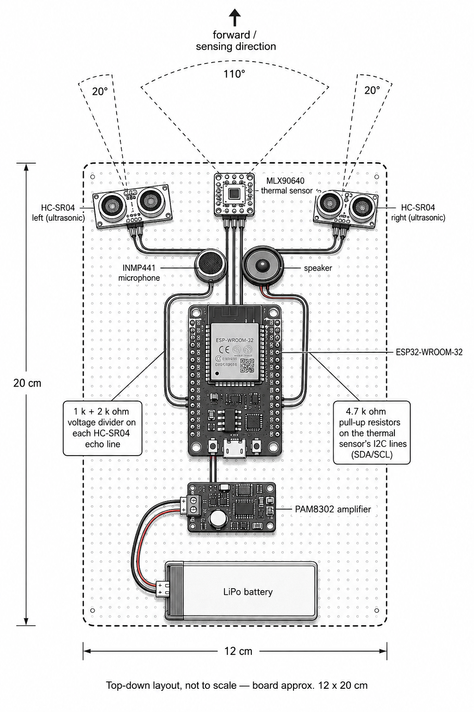

# NOVIS — Final Real Module: Build & Test Guide

**For the NOVIS team. This is the "we're done testing parts, now build the real thing" document.**

Assumes you have already read `docs/hardware_log.md` and Part B of
`docs/NOVIS_Build_Guide.md` — this document does not repeat the whole story of
*why* each wire is where it is, only what to physically do. If a step here
confuses you, the two documents above have the long explanation.

## Contents

| # | Section | Read it when |
|---|---|---|
| 0 | [Read this first](#0-read-this-first) | Before anything else |
| 1 | [What you are building](#1-what-you-are-building) | Before anything else |
| 2 | [Parts and tools checklist](#2-parts-and-tools-checklist) | The night before — check you have everything |
| 3 | [Safety rules](#3-safety-rules--read-every-time-not-just-once) | Every session, before touching a wire |
| 4 | [The full pin plan](#4-the-full-pin-plan-single-source-of-truth) | Keep open the whole time you wire |
| 5 | [Step-by-step construction](#5-step-by-step-construction-top-to-bottom-matching-the-picture) | **The main build section** |
| 6 | [Test after each build step](#6-test-after-each-build-step-use-the-existing-bench-sketches) | After every build step in Section 5 |
| 7 | [Powering from the LiPo battery](#7-powering-the-module-from-the-lipo-battery) | Before build step 8 (the battery step) |
| 8 | [Security and safety](#8-security-and-safety--lock-these-in-during-the-build) | Before you build, not after |
| 9 | [Command cheat sheet](#9-command-line-buildupload-cheat-sheet) | Whenever you compile or upload |
| 10 | [Troubleshooting](#10-troubleshooting-quick-reference) | When something fails |
| 11 | [What's next](#11-whats-next-after-this-module-is-built-and-passing) | After the module passes |
| 12 | [Build record — fill this in](#12-build-record--fill-this-in-as-you-go) | **As you go**, not at the end |

> **Naming, so nothing is ambiguous:** "**build step N**" always means a step
> inside Section 5. "**Section N**" always means a whole numbered section of
> this document.

---

## 0. Read this first

### What this document is for

Every sensor (thermal, both sonars, mic, speaker) has already been wired and
individually tested on a breadboard (Part B, `docs/hardware_log.md`). This
document is the next step: **put all five modules onto one board, in the
real layout, wire them all at once, power the whole thing from the LiPo
battery, and re-test it as one finished module.**

### The one rule, still

Build **top to bottom**, the same order as the picture in Section 1. After
each module goes on, run its own small test sketch again (Section 6) before
adding the next one. Yes, even though each sensor already passed alone on a
breadboard — a module that works alone can fail once it shares a board,
a battery, and a ground with four other modules. The most common reason:
**grounds that look connected but aren't.**

### Where each sensor stands

All four sensors have been tested on the breadboard and work:

| Part | Status |
|---|---|
| Thermal (MLX90640) | **PASS** |
| Sonar (HC-SR04 x2) | **PASS** |
| Microphone (INMP441) | **PASS** |
| Speaker + amp (PAM8302) | **PASS** |

So nothing is unknown going in. **Still run Section 6 on the assembled
board** though — those passes were on temporary breadboard wiring, and the
point of Section 6 is to catch what changes when five modules share one
board, one ground and one power source. It should be quick, since you already
know what a pass looks like for each one.

---

## 1. What you are building

This is the target layout — everything on one board, roughly **12 cm × 20 cm**:



Read the picture like this:

- **Top row:** the two HC-SR04 sonars (left and right), and the MLX90640
  thermal sensor between them. All three point the same "forward" direction.
- **Sensing cones:** the thermal sensor's field of view is the wide **110°**
  cone in the middle. Each sonar is angled about **20° outward** from
  centre — left sonar aimed slightly left, right sonar aimed slightly right.
  This spread is intentional: the sonars cover the sides the thermal sensor's
  centre view doesn't see as well.
- **Middle row:** the INMP441 microphone (left) and the speaker (right),
  close together, both facing forward.
- **Centre:** the ESP32-WROOM-32 board — the brain of the module. Two call-out
  boxes point at it:
  - *"1k + 2k ohm voltage divider on each HC-SR04 echo line"* — you will build
    **two** of these (one per sonar). See Section 5.
  - *"4.7k ohm pull-up resistors on the thermal sensor's I2C lines (SDA/SCL)"*
    — **two** resistors, see Section 5.
- **Below the ESP32:** the PAM8302 amplifier, which drives the speaker.
- **Bottom:** the LiPo battery, powering everything.

---

## 2. Parts and tools checklist

### Sensor/electronics parts (should already be in hand — this is the same list as Part B)

- [ ] 1x ESP32-WROOM-32 DevKit board
- [ ] 1x MLX90640 thermal sensor module (a GY-MCU90640 in our case — see the
  `PS`-pin note in Section 5)
- [ ] 2x HC-SR04 ultrasonic sensor
- [ ] 1x INMP441 I2S microphone breakout
- [ ] 1x 3W 8Ω speaker
- [ ] 1x PAM8302 audio amplifier breakout
- [ ] 1x LiPo battery (150 mAh or similar, whatever the team already has)

### Passive components — buy/check these specifically for the final build

- [ ] 2x 1 kΩ resistor + 2x 2 kΩ resistor (for the two HC-SR04 voltage dividers)
- [ ] 2x 4.7 kΩ resistor (for the MLX90640 I2C pull-ups)
- [ ] Perfboard or a second, larger breadboard, roughly 12 cm x 20 cm or bigger
  (the picture is "not to scale" — get one at least this size so nothing is
  cramped)
- [ ] Jumper wires: male-to-male and male-to-female, a good handful of each
- [ ] Something rigid to mount everything on (a stiff board, 3D-printed
  bracket, or thick cardboard as a first pass) and hot glue or double-sided
  tape to keep parts from shifting

### Tools

- [ ] Multimeter — you will use this constantly in this build, not just at
  the end. Check every VCC/GND pair for a short **before** powering on.
- [ ] Soldering iron + solder, if your PAM8302/speaker connection needs it
  (see Section 5, PAM8302 wiring — the speaker's connector usually does not
  fit the board and needs bare-wire soldering)
- [ ] Small screwdriver (for the PAM8302 volume trim pot, if present)
- [ ] USB cable that carries **data** (not a charge-only cable)
- [ ] Laptop with Arduino IDE 2.x set up per Part A of `docs/NOVIS_Build_Guide.md`

### Software — confirm this the night before, not on the bench

- [ ] `esp32` board package installed, **ESP32 Dev Module** selectable
- [ ] Libraries installed: **Adafruit MLX90640**, **Adafruit BusIO**,
      **Crypto** (by Rhys Weatherley)
- [ ] The board shows up in `arduino-cli board list` (if not, install the
  Silicon Labs CP210x VCP driver — see B1 in `docs/NOVIS_Build_Guide.md`)
- [ ] A test compile already succeeds, so a missing library doesn't stop you
  mid-build — run this once, the night before:

```bash
arduino-cli compile --fqbn esp32:esp32:esp32 firmware/bench_tests/B6_full_module_test
```

It should end with a "Sketch uses ... bytes" line and no errors. (This sketch
is already compile-verified against `esp32:esp32:esp32` — if it fails on your
machine, it's your toolchain or a missing library, not the code.)

---

## 3. Safety rules — read every time, not just once

1. **Unplug USB (and disconnect the battery) before changing any wire.**
   Rewiring a powered board is the single most common way to destroy a chip.
2. **The ESP32 is 3.3 V only.** The HC-SR04's ECHO pin outputs 5 V. Putting
   5 V straight onto any ESP32 GPIO can permanently kill it. Every ECHO line
   **must** go through the voltage divider in Section 5 — no exceptions,
   no "just this once to test it faster."
3. **Check polarity before connecting the battery.** Reversing + and − on
   the LiPo destroys almost everything downstream instantly. Check it with
   a multimeter, not by eye, the first time.
4. **One module at a time, test after each.** See Section 6.
5. **Every module must share one common ground.** If two modules' GND pins
   are not actually tied together (a loose jumper, a bad solder joint), you
   get exactly the kind of "worked alone, fails together" symptom this
   build is designed to catch early.

---

## 4. The full pin plan (single source of truth)

This is the same B6 pin plan used in Part B6 of `docs/NOVIS_Build_Guide.md`,
in every bench sketch under `firmware/bench_tests/`, and in the driver draft
at `firmware/bench_tests/sensors_combined_compile_check/`. (Note:
`firmware/novis_node/sensors.cpp` itself is still stubs and has no pin
numbers in it yet — see Section 11.)

Wire to this table. If you must change a pin, **update this table and every
place that quotes it** — do not let the board and the docs disagree.

| Signal | ESP32 pin | Notes |
|---|---|---|
| MLX90640 VIN | 3V3 | |
| MLX90640 GND | GND | |
| MLX90640 SDA | **GPIO21** | + 4.7kΩ pull-up to 3V3 |
| MLX90640 SCL | **GPIO22** | + 4.7kΩ pull-up to 3V3 |
| MLX90640 PS | **GND** | **required** — see Section 5, this takes the module's onboard STM32 off the I2C bus |
| HC-SR04 LEFT VCC | 5V / VIN | |
| HC-SR04 LEFT GND | GND | |
| HC-SR04 LEFT TRIG | **GPIO16** | direct wire, no divider needed (it's an output) |
| HC-SR04 LEFT ECHO | **GPIO17** | **through the 1k/2k divider** — never direct |
| HC-SR04 RIGHT VCC | 5V / VIN | |
| HC-SR04 RIGHT GND | GND | |
| HC-SR04 RIGHT TRIG | **GPIO18** | direct |
| HC-SR04 RIGHT ECHO | **GPIO19** | **through the 1k/2k divider** |
| INMP441 VDD | 3V3 | |
| INMP441 GND | GND | |
| INMP441 SCK (bit clock) | **GPIO14** | |
| INMP441 WS (word select) | **GPIO15** | |
| INMP441 SD (data out) | **GPIO32** | |
| INMP441 L/R | **GND** | required — floating L/R means silence |
| PAM8302 VIN | 3.3V or 5V (see Section 7 for battery power) | |
| PAM8302 GND | GND | |
| PAM8302 A+ | **GPIO4** | |
| PAM8302 A− | GND | |
| PAM8302 SD (if present on your board) | **VIN** | tie it to its own VIN pin — required or the amp stays muted |
| PAM8302 OUT+ / OUT− | Speaker wires | solder, don't just twist — see Section 5 |

---

## 5. Step-by-step construction (top to bottom, matching the picture)

Do these **in order**. After each numbered step, jump to the matching test
in Section 6 before continuing.

### Build step 1 — Base board

Lay out your perfboard/breadboard so you have roughly 20 cm of length to
work with top-to-bottom and 12 cm across. Decide "forward" (the direction
everything will point) and mark it — a piece of tape with an arrow works
fine. Everything below is described relative to that arrow.

### Build step 2 — Mount the ESP32 in the centre

Place the ESP32 roughly in the middle of the board, USB port facing a side
you can still reach after everything else is mounted (you will need to plug
in USB many more times before this is done). Don't wire anything to it yet.

### Build step 3 — MLX90640 thermal sensor, top-centre

1. Mount the MLX90640 module at the top-centre of the board, facing forward.
2. **Check the label on your module first.** If it says GY-MCU90640, it has
   a `PS` pin that **must** go to GND (this is not optional — without it,
   the module's own onboard chip fights the ESP32 for the I2C bus). See
   `docs/hardware_log.md` section 4 if you want the full story.
3. Wire VIN → 3V3, GND → GND, SDA → GPIO21, SCL → GPIO22, PS → GND.
4. Build two pull-up resistors: one 4.7kΩ from the SDA line to 3V3, one
   4.7kΩ from the SCL line to 3V3. This is one of the two call-out boxes in
   the picture.

   ```
   3V3 ----[ 4.7k ]---- SDA line (also going to ESP32 GPIO21)
   3V3 ----[ 4.7k ]---- SCL line (also going to ESP32 GPIO22)
   ```

5. **Power-cycle by unplugging and replugging USB** (not just pressing the
   reset button) — the `PS` pin is only read once, at power-up.

### Build step 4 — HC-SR04 sonars, left and right

1. Mount one HC-SR04 at the top-left of the board, angled about 20° to the
   left of "forward". Mount the second at the top-right, mirrored (20° to
   the right). Do the **left one first, wire it, test it (Section 6),** then
   do the right one — don't wire both blind.
2. For **each** sonar, build a voltage divider on its ECHO line — this is
   the second call-out box in the picture:

   ```
   HC-SR04 ECHO ----[ 1k ]----+----[ 2k ]---- GND
                               |
                        this midpoint wire goes to the ESP32
                        (≈ 3.33 V, safe for a 3.3 V GPIO)
   ```

   Do **not** put a divider on TRIG — TRIG is an ESP32 output going *into*
   the sensor, and 3.3 V is already enough to trigger it.
3. Wire per the Section 4 table: LEFT TRIG→GPIO16, LEFT ECHO (via divider)
   →GPIO17, RIGHT TRIG→GPIO18, RIGHT ECHO (via divider)→GPIO19. VCC of both
   sonars → the 5V/VIN pin (while testing on USB power — see Section 7 for
   battery).

### Build step 5 — Microphone and speaker, middle row

1. Mount the INMP441 microphone just below and between the two sonars,
   and the speaker beside it (the picture shows mic on the left, speaker
   on the right). Keep them close — about 3 cm apart — and both facing
   forward, same as the sonars and thermal sensor.
2. Wire the INMP441: VDD→3V3, GND→GND, SCK→GPIO14, WS→GPIO15, SD→GPIO32,
   **L/R→GND** (do not skip this — a floating L/R pin means the mic outputs
   nothing at all).
3. For the speaker, you'll connect it through the PAM8302 amplifier in the
   next step — don't wire it straight to the ESP32, the chip can't supply
   enough current and you risk damaging it.

### Build step 6 — PAM8302 amplifier, below the ESP32

1. Mount the PAM8302 board below the ESP32.
2. Wire: VIN→3.3V or 5V (see Section 7 for the battery case), GND→GND,
   A+→GPIO4, A−→GND.
3. **If your board has a separate `SD` (shutdown) pin, tie it to VIN.** Left
   floating, the amp stays permanently muted no matter what signal reaches
   A+ — this is a real, already-hit failure mode on this exact board, see
   `docs/hardware_log.md` section 8, Finding 1.
4. Connect the speaker to the OUT+/OUT− pads. If the speaker has a
   JST-PH2.0 connector, it will **not** plug into this board — cut it off,
   strip the two wires (red = OUT+, black = OUT−; swapping them is harmless,
   just an inaudible phase flip), and **solder them**, don't just loop and
   twist the bare wire through the hole. A twisted-not-soldered joint can
   look fine and still make poor contact — this cost real debugging time
   already (section 8, Finding 2).

### Build step 7 — Final check before first power-on

Do this **every time** you finish wiring a module, before plugging anything
in — not just once at the end:

- Multimeter, continuity mode: touch one probe to any GND pin, the other
  probe to every other GND pin on every module. All should read continuous
  (near 0Ω). This is the single most useful five-minute check in this whole
  build.
- Multimeter again: check there is **no** continuity between 3V3 and GND, or
  between 5V and GND. Continuity there means a short — find it before you
  power on, not after.
- Visually check no exposed wire is touching another exposed wire.
- Check nothing 5V is wired straight into a GPIO without going through the
  divider (recheck both ECHO lines specifically).

### Build step 8 — LiPo battery, at the bottom — **do this last**

⚠️ **Do not wire the battery until every test in Section 6 passes on USB
power.** Adding an untested power source to an untested circuit means that
when something fails you won't know whether it's the wiring or the power.
Bench-test everything on USB first — that is also exactly how each sensor was
originally tested, so you are comparing like with like.

When Section 6 is fully green on USB, go to Section 7, pick a power option
(boost converter vs. direct LiPo), wire it, then re-run the tests on battery.

---

## 6. Test after each build step (use the existing bench sketches)

These are the exact sketches already written and saved in
`firmware/bench_tests/`. Compile and upload each with the ESP32 selected as
**ESP32 Dev Module**. Open the Serial Monitor at **115200 baud**, and open it
**before** the board finishes booting (or press **EN** once it's open) — open
it late and you miss the startup lines, which looks like the sketch isn't
running when it actually is.

| After you build... | Run this sketch | Pass looks like |
|---|---|---|
| Build step 3 (thermal) | `firmware/bench_tests/i2c_scanner/i2c_scanner.ino` **first** | Exactly one device, `0x33`, and nothing else. Extra phantom addresses = floating bus or `PS` not grounded — fix that before running the thermal test. |
| Build step 3 (thermal) | `firmware/bench_tests/B2_thermal/B2_thermal.ino` | A grid of numbers around 20-30 (room temp). Put your hand in front — numbers there jump to 30-37. |
| Build step 4 (sonars) | `firmware/bench_tests/B3_sonar/B3_sonar.ino` | Hold a hand/book at a **fixed** ~30 cm in front of ONE sensor. 5-6 readings in a row should cluster near 290-310 mm, not jump around by metres. Test left, then right. |
| Build step 5 (mic) | `firmware/bench_tests/B4_microphone/B4_microphone.ino` | Peak number is small and steady in a quiet room, jumps sharply on a clap, settles back down after. |
| Build step 6 (speaker+amp) | `firmware/bench_tests/B5_speaker_chirp/B5_speaker_chirp.ino` | A short, quiet tick/chirp every 2 seconds. Can't hear it? Try the "pop test": briefly touch the A+ wire to VIN — a working amp+speaker pops audibly, no code needed. |
| Build steps 5+6 together | `firmware/bench_tests/B5_mic_speaker_echo_test/B5_mic_speaker_echo_test.ino` | The "AFTER chirp" mic peak reads clearly higher than "BEFORE chirp". This is the real echolocation proof — you don't need to hear it. |

**If any of these fail on the assembled board** after having passed alone on
a breadboard earlier: check common ground first (build step 7), then re-seat
that module's wiring — loose breadboard/perfboard contacts are the single
most repeated cause of trouble in this whole project (it's what took two
days to diagnose on the thermal sensor, see `docs/hardware_log.md` section 4).

### Now run the whole module together

Once every individual test above passes on the assembled board, run the
combined test — this is new, written specifically for this final module:

`firmware/bench_tests/B6_full_module_test/B6_full_module_test.ino`

Open the Serial Monitor at **115200 baud**. Every second you should see a
block like:

```
---------------------------------------------
Thermal   : centre=26.8C  min=24.1C  max=27.9C
Sonar     : left=612 mm   right=598 mm
Echo test : mic peak before=81422  after=612030  <- spike seen, echo path is working
```

**Pass criteria for the full module:**
- Thermal line shows a sensible room temperature, changes when you put a
  hand in the thermal sensor's field of view
- Sonar numbers roughly match a tape measure held in front of each sensor,
  and don't jump wildly with nothing moving in front of them
- Echo test shows "after" clearly bigger than "before" (the code flags this
  with `<- spike seen`) after most chirps

If this passes, **the physical module is built and working on USB power.**
Now — and only now — go to Section 7 and add the battery (build step 8),
then run this same combined test again on battery.

---

## 7. Powering the module from the LiPo battery

This is the one part of the picture that needs a decision, because a plain
ESP32-WROOM-32 DevKit does not have a built-in LiPo charging/regulation
circuit — everything in Part B was tested on USB power, which supplies a
clean 5V.

You have two options. **Pick one, wire it, and write down which one you
used** — this goes in the paper's hardware section either way.

### Option A — boost converter (recommended, safest, matches everything you already tested)

Add a small 3.7V→5V boost converter module (for example, anything built
around an MT3608 chip — cheap and common) between the LiPo and everything
else:

```
LiPo (+) ---> boost converter IN+  ...  boost converter OUT+ (5V) ---> ESP32 5V/VIN pin
                                                                   ---> PAM8302 VIN
                                                                   ---> both HC-SR04 VCC
LiPo (−) ---> boost converter IN−  ...  boost converter OUT− ---> common GND
```

This gives every module the same clean 5V it already passed its test on. The
one extra part (a boost module) is a small cost for not having to re-debug
sensors that behave differently at a lower, sagging battery voltage.

### Option B — direct raw LiPo (matches the literal picture, more risk)

If you connect the LiPo straight to the ESP32's VIN pin and to the PAM8302
and HC-SR04 VCC lines (as the picture's wiring literally shows: LiPo → PAM8302
power pads → jumped up to the ESP32), be aware of two real, documented risks
before you rely on it:

1. **HC-SR04 modules are rated for 5V and many become unreliable below about
   4.5V.** A LiPo sags from ~4.2V (full) down to ~3.7V (nominal) to ~3.3V
   (nearly empty) — most of that range is already below where a 5V-rated
   sonar is guaranteed to behave. Test yours specifically: if sonar readings
   get worse as the battery drains, you need Option A, or a 3.3V-native
   sensor like the RCWL-1601.
2. **The ESP32 DevKit's onboard 3.3V regulator expects a 5V-ish input on
   VIN.** Feeding it a raw LiPo (well under 5V, and dropping further as it
   discharges) can starve the regulator, causing random resets ("brownouts")
   especially when the WiFi/BLE radio draws a current spike. If you see the
   board randomly restart only on battery, never on USB, this is why.

**If you choose Option B, test it immediately after wiring** — run the B6
combined test sketch on battery power only (USB unplugged) and watch for
random resets or sonar numbers getting worse as you watch. Don't assume it
works just because it powers on.

### Either way

- **Do not leave USB plugged in while the battery is also connected**, unless
  you know your specific board handles both safely. Some DevKit clones have
  no protection diode between the USB 5V rail and the VIN pin, so USB power
  and battery power end up fighting each other. Rule of thumb for this build:
  **USB for flashing and bench tests, battery for battery tests — one at a
  time**, and unplug one before connecting the other.
- Wire LiPo (+) and (−) with correct polarity — double-check with a
  multimeter before connecting. Reversed polarity destroys things instantly.
- All grounds (ESP32, PAM8302, both sonars, mic, and the battery's own
  ground) must be the same one common ground net.
- Re-run the full Section 6 test suite once on battery power — a module that
  passed on USB can behave differently on battery if the current draw
  (especially the amplifier and the ESP32's radio) sags the battery voltage
  under load.

---

## 8. Security and safety — lock these in during the build

The point of this section: **security is not something you bolt on after the
data is already flowing.** Some of it is decided by how you build and wire
tomorrow; the rest is decided by how the firmware is ported. Read this now,
not at the end.

### 8.1 What the design already gives you

| Protection | Where it lives | Status |
|---|---|---|
| Every frame encrypted + authenticated (ChaCha20-Poly1305 AEAD) | `firmware/novis_node/crypto.h` (interface), `firmware/bench_tests/crypto_compile_check/` (working draft), `host/crypto.py` (host side, done) | design done, node-side draft compiles and runs on ESP32 |
| Wire format that carries the counter and auth tag: `counter(8) ‖ ciphertext ‖ tag(16)` | `firmware/novis_node/protocol.h` ↔ `host/protocol.py` | done, both sides match |
| BLE link encrypted with pairing + MITM protection ("numeric comparison") | `novis_node.ino` — `Bluefruit.Security.setIOCaps(...)` and `streamChar.setPermission(SECMODE_ENC_WITH_MITM, SECMODE_NO_ACCESS)` | **written in Bluefruit API only — see 8.2** |
| Stream characteristic is notify-only, a connected peer cannot write to the node | `novis_node.ino` — `CHR_PROPS_NOTIFY`, `SECMODE_NO_ACCESS` for write | same as above |

So the design has two independent layers: even if the BLE link security fails,
the frames themselves are still encrypted; and even if someone captures the
BLE traffic, they get ciphertext.

### 8.2 What is NOT secure right now — three real gaps

Be honest about these in the paper. Do not describe the current build as secure.

1. **The key is an all-zero placeholder.** Both node and host hard-code 32
   zero bytes so they can talk on the bench (`host/crypto.py` even logs a
   `SECURITY:` warning when it sees it). Anyone who knows the protocol can
   decrypt everything. Fix: derive a real session key with HKDF after LE
   Secure Connections pairing, and pass it to `crypto_set_session()`.

2. **The message counter resets to 0 on every reboot.** In `novis_node.ino`,
   `msgCounter` starts at 0 each boot. The nonce is `counter ‖ salt`, so if
   the *same key* is ever used across two boots, the same nonce is used
   twice — and for ChaCha20 that means an attacker who XORs the two
   ciphertexts recovers the plaintext. Harmless today only because the
   placeholder key is worthless anyway. **The moment a real key is
   introduced, this becomes a serious bug.** Fix, pick one: derive a fresh
   session key (or a fresh random salt) at every boot/connection, or persist
   the counter to NVS and never restart it.

3. **The ESP32 BLE port can silently drop the link security.** The pairing
   and MITM settings above are Bluefruit calls (nRF52-only). When someone
   rewrites that part for the ESP32 BLE stack, it is very easy to get a
   working data stream with **no pairing, no encryption, and a writable
   characteristic** — everything looks fine, and the link is wide open.
   Whoever does the port must consciously re-implement: encrypted link,
   MITM protection, and notify-only (no write) permission on the stream
   characteristic.

### 8.3 Build-time security checklist

Tick these off as you build and test tomorrow:

- [ ] After the module passes Section 6, flash
      `firmware/bench_tests/crypto_compile_check/` on **this** assembled
      board and confirm it prints `40` (that is 8 counter + 16 payload + 16
      tag). This proves the encryption path actually runs on your final
      hardware, not just on a laptop.
- [ ] Do **not** delete or "temporarily disable" the AEAD to make debugging
      easier. If you must see plaintext while debugging, print it over
      USB serial on the node — never send an unencrypted frame over BLE,
      because "temporary" plaintext paths are exactly what ends up shipping.
- [ ] Keep the placeholder key **only** in bench code, never in anything
      that gets published as "the secure version". When the real handshake
      lands, delete the all-zero fallback entirely rather than leaving it
      as a default.
- [ ] Never commit a real key, and never hard-code one in a sketch that
      goes into git. The key must come from the handshake at runtime.
- [ ] Write down, at build time, that the node advertises as `NOVIS-Node`
      and is discoverable to anyone in radio range. During capture sessions
      in shared rooms, that is worth knowing.

### 8.4 Data and privacy (this matters as soon as you start capturing)

The moment the module works, someone will point it at a room with people in
it. Part E of `docs/NOVIS_Build_Guide.md` has the full rules; the ones that
must be in place **before** the first real capture:

- **Consent from everyone in the room, before recording.** A simple written
  consent form: what is recorded, what it is used for, that faces will be
  blurred, and that they can ask for their data to be deleted.
- **Ethics approval** — start the paperwork now, it takes weeks, and the
  capture cannot legally start without it.
- **Blur faces in every reference photo before the data leaves the recording
  machine** — not later, not "before publishing".
- The 60 ms echo recordings are stored as spectrograms and speech cannot be
  recovered from them. That is a genuine privacy strength worth stating in
  the paper — but it only holds if you store spectrograms, not raw audio.

### 8.5 Physical and battery safety

The LiPo is the only part of this build that can actually hurt someone:

- Never short the battery terminals. Check polarity with a multimeter before
  connecting — reversed polarity can damage the cell as well as the boards.
- Do not charge the LiPo unattended or overnight, and never charge a cell
  that is puffed, dented, or punctured — dispose of it properly instead.
- Keep the battery where a stray jumper wire or a soldering iron cannot
  reach it. Tape over the terminals when the module is on the bench.
- Disconnect the battery before any rewiring — same rule as USB (Section 3).

---

## 9. Command-line build/upload cheat sheet

Faster than clicking through the IDE, and shows real compiler errors:

```bash
arduino-cli compile --fqbn esp32:esp32:esp32 firmware/bench_tests/B6_full_module_test
```

```bash
arduino-cli upload -p COM8 --fqbn esp32:esp32:esp32 firmware/bench_tests/B6_full_module_test
```

(Swap `COM8` for whatever `arduino-cli board list` shows on your machine.
Hold the **BOOT** button if upload gets stuck at "Connecting...".)

```bash
arduino-cli board list
```

---

## 10. Troubleshooting quick reference

| Symptom | Most likely cause | Fix |
|---|---|---|
| "MLX90640 not found" | `PS` not grounded, or not power-cycled after wiring it | Tie PS to GND, then **unplug and replug USB** (reset button is not enough) |
| Thermal `getFrame()` fails with -8 | I2C clock too slow for 8 Hz | Confirm `Wire.setClock(400000)` is in the code |
| Sonar reads jump around wildly, no fixed target | Ambient reflections with nothing to lock onto — not necessarily a fault | Re-test with a hand/book held at a **fixed** distance before judging pass/fail |
| Sonar always reads 0 | Divider midpoint not actually reaching the ESP32 pin, or TRIG/ECHO swapped | Re-check the 1k/2k divider wiring and pin numbers |
| Mic peak always exactly 0 | `L/R` not tied to GND, or SD/WS/SCK swapped | Check L/R→GND first, it's the most common miss |
| Mic peak always huge and constant | SD data pin floating | Re-check the SD wire and connection |
| No sound from speaker at all | PAM8302 `SD` pin floating (not tied to VIN), or a twisted-not-soldered speaker wire | Tie SD→VIN; solder OUT+/OUT− instead of twisting |
| Everything worked alone, fails once assembled | A ground that looks connected but isn't | Multimeter continuity test across every GND pin, module by module |
| Random resets only on battery, never on USB | Regulator brownout from raw LiPo voltage sag | Switch to the Option A boost converter in Section 7 |

---

## 11. What's next, after this module is built and passing

**Important, so nobody is surprised tomorrow:** this document gets you a
working *physical module* that you can test with the bench sketches. It does
**not** get you the finished node firmware that streams encrypted data to the
host — that code is genuinely not finished yet. Right now, in
`firmware/novis_node/`:

| File | Real state today |
|---|---|
| `novis_node.ino` | Targets **Bluefruit** (`#include <bluefruit.h>`) — nRF52-only, **will not compile for ESP32**. The BLE port has not been started. |
| `sensors.cpp` | Still **stubs** — returns fake test patterns (a warm band, sonar hard-coded to 1500/2200 mm). The real ESP32 drivers exist only as a draft in `bench_tests/sensors_combined_compile_check/`. |
| `crypto.cpp` | **Does not exist yet** — only `crypto.h`. The working implementation is the draft in `bench_tests/crypto_compile_check/`. |
| `protocol.h`, `sensors.h`, `crypto.h` | Done, and match the host side. |

So the remaining work, in order:

1. **Fold the drafts into the real files** — copy the driver bodies from
   `bench_tests/sensors_combined_compile_check/` into `sensors.cpp`, and
   `bench_tests/crypto_compile_check/` into a new `crypto.cpp`. Do this only
   after the module passes Section 6, so a wiring bug doesn't hide inside the
   merge.
2. **Port the BLE side of `novis_node.ino`** from Bluefruit to the ESP32 BLE
   stack (`BLEDevice.h`, or `NimBLE-Arduino`). This is real work, not a
   find-and-replace — **and re-read Section 8.2 first**, because the pairing,
   MITM protection and notify-only permission are easy to lose in the port
   without anything looking broken.
3. **Fix the counter/nonce issue** (Section 8.2, item 2) at the same time the
   real key handshake lands — not after.
4. **Real measurements for the paper**: battery life on the ESP32, current
   draw for each sensor combination, and sonar range accuracy from 1-10 m.
   Write down what you actually measure — never what you expected.

None of this blocks finishing the physical build described in this document.

---

## 12. Build record — fill this in as you go

This project's rule is **write down what you actually measured, never what you
expected**. Several of these numbers are things
`docs/hardware_log.md` section 9 lists as still owed to the paper, so filling
this in during the build saves re-doing the work later. Copy this table into
`docs/hardware_log.md` (or paste it back here) once it's filled.

**Build date:** ______________  **Built by:** ______________

### Test results

| Test | Sketch | Result (PASS / FAIL / notes) |
|---|---|---|
| I2C bus clean (only `0x33`) | `i2c_scanner` | |
| Thermal, hand test | `B2_thermal` | |
| Sonar LEFT at fixed 30 cm | `B3_sonar` | |
| Sonar RIGHT at fixed 30 cm | `B3_sonar` | |
| Mic, quiet vs clap | `B4_microphone` | |
| Speaker chirp audible / pop test | `B5_speaker_chirp` | |
| Mic+speaker echo spike | `B5_mic_speaker_echo_test` | |
| Full module combined | `B6_full_module_test` | |
| Encryption runs on this board (prints `40`) | `crypto_compile_check` | |

### Decisions and measurements the paper needs

| Question | Your answer |
|---|---|
| Power option used: A (boost converter) or B (direct LiPo)? | |
| If Option A: which boost module? | |
| Measured voltage at the HC-SR04 VCC pin, on battery | |
| Did the HC-SR04s still work on battery power? | |
| If not — did you switch to RCWL-1601, or a boost converter? | |
| Measured PAM8302 VIN voltage | |
| Any random resets/brownouts on battery? | |
| Final pin table — same as Section 4, or did anything change? | |
| Anything you had to solder that the docs assumed was plug-in | |

### Things that surprised you

Write down anything that cost you more than 15 minutes, even if you solved
it. That is exactly how sections 4-8 of `docs/hardware_log.md` came to exist,
and it is the most useful thing you can leave for whoever builds the second
module.
